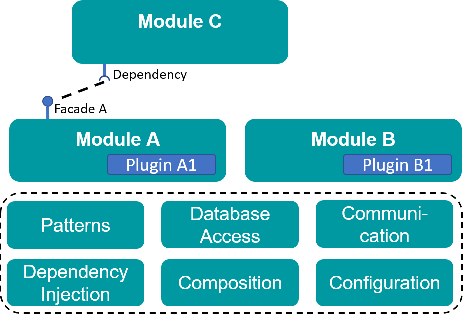
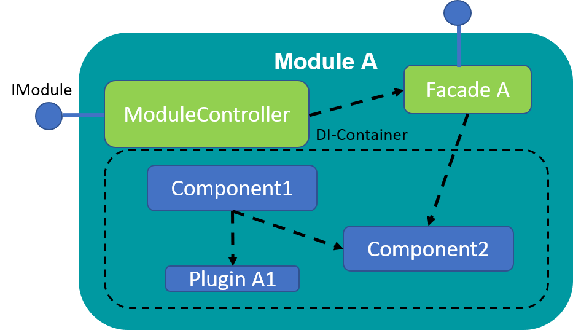

<p align="center">
    
</p>

<p align="center">
    <a href="https://github.com/PHOENIXCONTACT/MORYX-Core/workflows">
        
    </a>
    <a href="https://codecov.io/gh/PHOENIXCONTACT/MORYX-Core/coverage.svg?branch=dev">
        
    </a>
    <a href="https://github.com/PHOENIXCONTACT/MORYX-Core/blob/dev/LICENSE">
        
    </a>
    <a href="https://gitter.im/PHOENIXCONTACT/MORYX?utm_source=badge&utm_medium=badge&utm_campaign=pr-badge">
        
    </a>
</p>

# MORYX Core

The MORYX Core is a .NET based framework to quickly build three-tier applications. It aims to reduce boilerplate code as much as possible and provides modularity, flexibility and easy configuration with very little effort.
It originates from the original MORYX project targeted to develop machines but has expanded to a much bigger field of use. The MORYX Core defines a base namespace and set of interfaces used to develop modular applications.

The **MORYX AbstractionLayer** is the environment for the digital twins of resources and products. It defines the domain independent [meta model](/docs/articles/AbstractionLayer.md) and enables applications to model their physical system and product portfolio as typed objects. It thereby makes other modules hardware independent by encapsulating details of the underlying structure and devices. [Like the platform](https://github.com/PHOENIXCONTACT/MORYX-Platform#history) version 5.0 of the AbstractionLayer is focused on the open source community and we are still applying the final touches, while the in-house stable version powers a range of different applications.

**Links**

- [Package Feed](https://www.myget.org/feed/Packages/moryx)
- [Repository Template](https://github.com/PHOENIXCONTACT/MORYX-Template)
- [MORYX Factory](https://github.com/PHOENIXCONTACT/MORYX-Factory)

## Getting Started

If you want to start developing with or for MORYX, the easiest way is our [template repository](https://github.com/PHOENIXCONTACT/MORYX-Template). It comes with two empty solutions, the necessary package feeds and preinstalled empty MORYX runtime. Add projects and packages to backend and frontend solutions depending on your specific requirements. Install stable releases via Nuget; development releases are available via MyGet.

| Package Name | Release (NuGet) | CI (MyGet) | Future (MyGet) |
|--------------|-----------------|------------|------------|
| `Moryx` | [](https://www.nuget.org/packages/Moryx/) | [](https://www.myget.org/feed/moryx/package/nuget/Moryx) | [](https://www.myget.org/feed/moryx-future/package/nuget/Moryx) |
| `Moryx.Model` | [](https://www.nuget.org/packages/Moryx.Model/) | [](https://www.myget.org/feed/moryx/package/nuget/Moryx.Model) | [](https://www.myget.org/feed/moryx-future/package/nuget/Moryx.Model) |
| `Moryx.Model.InMemory` | [](https://www.nuget.org/packages/Moryx.Model.InMemory/) | [](https://www.myget.org/feed/moryx/package/nuget/Moryx.Model.InMemory) | [](https://www.myget.org/feed/moryx-future/package/nuget/Moryx.Model.InMemory) |
| `Moryx.Model.PostgreSQL` | [](https://www.nuget.org/packages/Moryx.Model.PostgreSQL/) | [](https://www.myget.org/feed/moryx/package/nuget/Moryx.Model.PostgreSQL) | [](https://www.myget.org/feed/moryx-future/package/nuget/Moryx.Model.PostgreSQL) |
| `Moryx.Container` | [](https://www.nuget.org/packages/Moryx.Container/) | [](https://www.myget.org/feed/moryx/package/nuget/Moryx.Container) | [](https://www.myget.org/feed/moryx-future/package/nuget/Moryx.Container) |
| `Moryx.Communication.Serial` | [](https://www.nuget.org/packages/Moryx.Communication.Serial/) | [](https://www.myget.org/feed/moryx/package/nuget/Moryx.Communication.Serial) | [](https://www.myget.org/feed/moryx-future/package/nuget/Moryx.Communication.Serial) |
| `Moryx.Tools.Wcf` | [](https://www.nuget.org/packages/Moryx.Tools.Wcf/) | [](https://www.myget.org/feed/moryx/package/nuget/Moryx.Tools.Wcf) | [](https://www.myget.org/feed/moryx-future/package/nuget/Moryx.Tools.Wcf) |
| `Moryx.Runtime.Wcf` | [](https://www.nuget.org/packages/Moryx.Runtime.Wcf/) | [](https://www.myget.org/feed/moryx/package/nuget/Moryx.Runtime.Wcf) | [](https://www.myget.org/feed/moryx-future/package/nuget/Moryx.Runtime.Wcf) |
| `Moryx.Runtime` | [](https://www.nuget.org/packages/Moryx.Runtime/) | [](https://www.myget.org/feed/moryx/package/nuget/Moryx.Runtime) | [](https://www.myget.org/feed/moryx-future/package/nuget/Moryx.Runtime) |
| `Moryx.Runtime.DbUpdate` | [](https://www.nuget.org/packages/Moryx.Runtime.DbUpdate/) | [](https://www.myget.org/feed/moryx/package/nuget/Moryx.Runtime.DbUpdate) | [](https://www.myget.org/feed/moryx-future/package/nuget/Moryx.Runtime.DbUpdate) |
| `Moryx.Runtime.Kernel` | [](https://www.nuget.org/packages/Moryx.Runtime.Kernel/) | [](https://www.myget.org/feed/moryx/package/nuget/Moryx.Runtime.Kernel) | [](https://www.myget.org/feed/moryx-future/package/nuget/Moryx.Runtime.Kernel) |
| `Moryx.Runtime.Kestrel` | [](https://www.nuget.org/packages/Moryx.Runtime.Kestrel/) | [](https://www.myget.org/feed/moryx/package/nuget/Moryx.Runtime.Kestrel) | [](https://www.myget.org/feed/moryx-future/package/nuget/Moryx.Runtime.Kestrel) |
| `Moryx.Runtime.Maintenance` | [](https://www.nuget.org/packages/Moryx.Runtime.Maintenance/) | [](https://www.myget.org/feed/moryx/package/nuget/Moryx.Runtime.Maintenance) | [](https://www.myget.org/feed/moryx-future/package/nuget/Moryx.Runtime.Maintenance) |
| `Moryx.Runtime.SmokeTest` | [](https://www.nuget.org/packages/Moryx.Runtime.SmokeTest/) | [](https://www.myget.org/feed/moryx/package/nuget/Moryx.Runtime.SmokeTest) | [](https://www.myget.org/feed/moryx-future/package/nuget/Moryx.Runtime.SmokeTest) |
| `Moryx.Runtime.WinService` | [](https://www.nuget.org/packages/Moryx.Runtime.WinService/) | [](https://www.myget.org/feed/moryx/package/nuget/Moryx.Runtime.WinService) | [](https://www.myget.org/feed/moryx-future/package/nuget/Moryx.Runtime.WinService) |
| `Moryx.TestTools.SystemTest` | [](https://www.nuget.org/packages/Moryx.TestTools.SystemTest/) | [](https://www.myget.org/feed/moryx/package/nuget/Moryx.TestTools.SystemTest) | [](https://www.myget.org/feed/moryx-future/package/nuget/Moryx.TestTools.SystemTest) |
| `Moryx.AbstractionLayer` | [](https://www.nuget.org/packages/Moryx.AbstractionLayer/) | [](https://www.myget.org/feed/moryx/package/nuget/Moryx.AbstractionLayer) | [](https://www.myget.org/feed/moryx-future/package/nuget/Moryx.AbstractionLayer) |
| `Moryx.AbstractionLayer.TestTools` | [](https://www.nuget.org/packages/Moryx.AbstractionLayer.TestTools/) | [](https://www.myget.org/feed/moryx/package/nuget/Moryx.AbstractionLayer.TestTools) | [](https://www.myget.org/feed/moryx-future/package/nuget/Moryx.AbstractionLayer.TestTools) |
| `Moryx.AbstractionLayer.Products.Endpoints` | [](https://www.nuget.org/packages/Moryx.AbstractionLayer.Products.Endpoints/) | [](https://www.myget.org/feed/moryx/package/nuget/Moryx.AbstractionLayer.Products.Endpoints) | [](https://www.myget.org/feed/moryx-future/package/nuget/Moryx.AbstractionLayer.Products.Endpoints) |
| `Moryx.AbstractionLayer.Resources.Endpoints` | [](https://www.nuget.org/packages/Moryx.AbstractionLayer.Resources.Endpoints/) | [](https://www.myget.org/feed/moryx/package/nuget/Moryx.AbstractionLayer.Resources.Endpoints) | [](https://www.myget.org/feed/moryx-future/package/nuget/Moryx.AbstractionLayer.Resources.Endpoints) |
| `Moryx.Notifications` | [](https://www.nuget.org/packages/Moryx.Notifications/) | [](https://www.myget.org/feed/moryx/package/nuget/Moryx.Notifications) | [](https://www.myget.org/feed/moryx-future/package/nuget/Moryx.Notifications) |
| `Moryx.Products.Management` | [](https://www.nuget.org/packages/Moryx.Products.Management/) | [](https://www.myget.org/feed/moryx/package/nuget/Moryx.Products.Management) | [](https://www.myget.org/feed/moryx-future/package/nuget/Moryx.Products.Management) |
| `Moryx.Products.Model` | [](https://www.nuget.org/packages/Moryx.Products.Model/) | [](https://www.myget.org/feed/moryx/package/nuget/Moryx.Products.Model) | [](https://www.myget.org/feed/moryx-future/package/nuget/Moryx.Products.Model) |
| `Moryx.Resources.Management` | [](https://www.nuget.org/packages/Moryx.Resources.Management/) | [](https://www.myget.org/feed/moryx/package/nuget/Moryx.Resources.Management) | [](https://www.myget.org/feed/moryx-future/package/nuget/Moryx.Resources.Management) |

If you wish to contribute to this project, you simply need to clone the repository and open the solution with Visual Studio 2017 or above. The Debug target should be *StartProject*.

To build and run from the command line you need powershell and msbuild.

```powershell
.\Build.ps1 -Build
.\src\StartProject\bin\Debug\StartProject.exe
```

Whether you want to debug and experiment with this repository or build an application based on the Abstraction Layers packages you need to follow a few simple steps to setup each of the modules. For both modules this requires the package *Moryx.Runtime.Maintenance.Web* and its [database configuration](http://localhost/maintenanceweb/#/databases).

**Product Management**:
1. Create or configure the database for *Moryx.Products.Model* using the Maintenance
2. Configure the [storage mapping](/docs/articles/Products/ProductStorage.md) for your domain objects. This is necessary to store, load and use the objects within MORYX.

**Resource Management**:
1. Create or configure the database for *Moryx.Resources.Model*
2. Execute the `ResourceInteractionInitializer` from [ResourceManager console](http://localhost/maintenanceweb/#/modules/ResourceManager/console) to provide the endpoint for the resource configuration UI.

## Architecture
The MORYX Core is a .NET based framework to quickly build three-tier applications. The core architecture is a modular monolith using the service and facade pattern to isolate and decouple functionality. It uses a 2-level Dependency Injection structure to isolate a modules composition and offer a per-module life-cycle with all instances hidden behind the previously mentioned facades. It also offers a range of tools and components to speed up development, increase stability and drastically reduce boilerplate code. To improve flexibility of modules and applications the core has built in support for configuration management as well as plugin loading.

<p align="center">
    
</p>

Each modules composition is constructed by its own DI-container instance. This makes it possible to dispose the container in order to restart the module and reconstruct the composition with a different configuration or to recover from a fatal error. The `ModuleController` and `Facade` instances are preserved through the lifecycle of the application as part of the level 1 composition. The  Components (*always present*) and plugins (*configurable*) are created when a module is started and disposed when the module stops. For each lifecycle the references of the facade are updated.

<p align="center">
    
</p>

## Resource Management

The [Resource Management](/docs/articles/Resources/ResourceManagement.md) holds the object graph representing the physical system. It maintains the database entities for the object graph in the background and reconstructs the object graph upon boot. It also provides the API for other modules to interact with resources based on their implemented interfaces and supports resource look-up by various conditions or capabilities.

## Product Management

The [Product Management](/docs/articles/Products/ProductManagement.md) holds all product variants, created instances of those variants and recipes how to create an instance. It provides an API giving access to product types, instances, recipes and workplans.

## Tutorials

To start using the MORYX for your own projects you can jump into these tutorials:

* [How to create a Resource](/docs/tutorials/HowToCreateResource.md)
* [How to build a Driver](/docs/tutorials/HowToBuildADriver.md)
* [How to create a Product](/docs/tutorials/HowToCreateAProduct.md)
* [How to create a Server Module](/docs/tutorials/ServerModule/ServerModule.md)

## Maintenance

Part of the Core is also the Maintenance module, which hosts a HTTP REST service and *optionally* a graphic web interface to control and configure a MORYX application. The Maintenance itself does not define that logic, but simply provides easy external access to APIs and features of the runtime kernel.

## History

Starting with version 3.0 of the core we decided to open source it as a foundation for Industrial IoT (IIoT) applications. For this public version, the framework received an overhaul to replace commercial libraries and tools, remove specialized Phoenix Contact code and better comply with the .NET open source community.

Version 6 uses .net 6 with ASP.net Core and EntityFramework 6. All WPF UIs were replaced by WebUIs.

A few examples of solutions build on MORYX are listed below:

- Manufacturing Control System
- Plastic Mold Tracking
- Intralogistics
- Home Automation