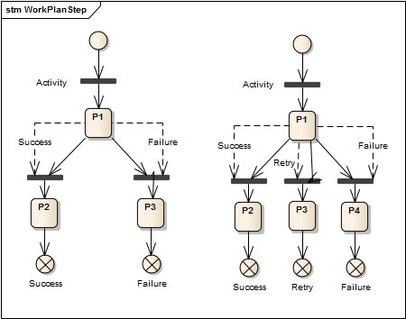

# Workplans and WorkplanInstances

As part of the _Moryx-package_ the namespace _Moryx.Workplans_ and its static class API entry-point `WorkplanInstance` provide a petry-net based implementation of a workplan engine. We distinguish `Workplan`s, which are the underlying model or type, and `WorkplanInstance`s, which contain the required petri-net information and can be executed.  The namespace and its components can be grouped into creation/representation and execution/monitoring.

## Workplan Modeling

The model of a workplan instance is called `Workplan` and implemented as an object graph of two types of classes - steps ([IWorkplanStep](xref:Moryx.Workplans.IWorkplanStep)) and connectors ([IConnector](xref:Moryx.Workplans.IConnector)). The workplan declares a collection for each type of object, namely `Steps` and `Connectors`. The two `IConnector`-arrays `Inputs` and `Outputs` on `IWorkplanStep` create the graph of the executable workplan instance as two steps referencing the same connector (one as output and one as input) are implicitly connected.

### Definitions

- An activity is the base type for all kinds of activities. An Activity is executed by a resource. An activity references the process it belongs to.
- An activity can have one or more aspects.
- A production activity represents the execution of a production step.
- A production activity can have access to the data of a product.
- A process step can have a material which is available for production. If no material is given, the production activity provides some material, e.g. the worker puts some material on a WPC.
- A process is a series of activities.
- A production process contains a reference to the data of the workpiece the process is physically working on.
- A task is used to define and create an Activity.
- A work plan step is a part of a work plan and references a Task.
- The workflow references a work plan as its defintion and uses tasks to create activities. A workflow is a living object created for each process. For production processes there is one process and one workflow for each workpiece.
- Though workpiece is usually not used for electronic devices, it is at least unambiguous. Therefore the term "Article" shall be replaced with "Workpiece". Workpiece fits very well to the term "Workpiece Carrier".

### Workplan Nodes

The previously mentioned connectors and steps share the common interface [IWorkplanNode](xref:Moryx.Workplans.IWorkplanNode). A workplan node declares two properties `Id` and `Name`. The `Name` is set manually while the `Id` is assigned when the node is added to the workplan. The `Id` is only unique to the workplan the node was added to but remains unchanged for its entire lifecycle.

**Connectors** define the connection between two steps to define the possible paths from the start of the workplan over the used tasks until an endpoint is reached. They are rather plain objects that, besides inherited properties, only declare their [classification](xref:Moryx.Workplans.NodeClassification). The _classification_ distinguishes between _Entry_ and _Exit_ points of the workplan or simple connections between two steps.

**WorkplanSteps** are basically the Tasks which must be implemented in an application to define the needed step in the production. The task will create the corresponding activity during the processing of the workplan. The workplan engine, as most of MORYX, was created in the context of industrial automation where the steps represent manufacturing steps of a product. Independent from its origin the workplan engine was designed to be domain-indepent. For this purpose users of the workplan engine need to create implementations of `IWorkplanStep` for the actions of their domain.

To implement `IWorkplanStep` it is recommended to derive from `WorkplanStepBase`, which already implements most of the interface. Per default this defines a step with one input and one output. Besides the `Name` of the step the most important part to implement is the definition of outputs and creation of an executable `ITransition` from the step. While `IWorkplanStep` instances only represent an action in the workplan object graph, `ITransition` implement the executable code to perform the action. 

## Concept

- Workflows are handled as Coloured Petri Nets
- Every work plan step corresponds to a Petri Net



Unlike MORYX Classic, there shall be not one single large workplan but separate small workplans to get from one construction level to the next one.
In addition to the work plan steps work plans may contains splits and joins to support parallel processing. Therefore there will be not one single token inside the net as in MORYX Classic but a group of tokens. 

The ProcessController will be changed to get a list of activities instead of a single one. The list may be empty if there is a join still waiting for other tokens. The workflow finishes if the list of activities is null.

Using reflection, it is quite easy to navigate through the properties of an object tree. The workflow editor could load the product definition from the control system or directly from TeamCenter. The reference to the property could be stored like an XPath.

The work plan editor validates the work plan for soundness.

To support identical (or at least compatible) production facilities, the work plan editor can push a work plan to more than one facility.

The Control System checks the workplan on import for compatibility.

A work plan has a version identifier. There is some kind of release management needed. The process tracing data refers one distinct version of the work plan.

To reduce waist there must be a possibility to change the work plan version while the process is running. To change should be allowed only if the finished and the current steps are equal to the new definition. It should be quite easy to check the tracing data whether the new definition would have led to the same tracing result. It should be forbidden to change the version if the tracing data does not fit to the new one.

For each group of splits and joins leading to parallel threads there must be a bounding box with exactly one entry and one exit. The only exception of this rule is a global abort, if the process shall be terminated in case of an error. It is difficult (or even impossible) to validate termination if loops are allowed, because the termination of the loop cannot be validated at all.


## Create a Workplan

The most comfortable way is to use the workplan editor to draw the workplan with the created task. But it is also possible to create a workplan programmatically to use it for example during the product import. A self-created workplan could look like this:

```` cs
// Prepare workplan
var workplan = new Workplan { Name = "My Workplan" };

// Boundaries
var start = workplan.AddConnector("StartConnector", NodeClassification.Start);
var end = workplan.AddConnector("End", NodeClassification.End);
var failed = workplan.AddConnector("Failed", NodeClassification.Failed);

// The first input is the start connector
var input = start;
// Output of the success path
var output = workplan.AddConnector("Mounted");
workplan.AddStep(new MountTask(), new AssembleParameters(), input, output, failed);

// The output is the input for the next task
input = output;
output = workplan.AddConnector("First task done");
workplan.AddStep(new MyTask(), new MyParameters(), input, output, failed, failed);

input = output;
output = workplan.AddConnector("Second task done");
workplan.AddStep(new MyTask(), new MyParameters(), input, output, failed, failed);

input = output;
output = workplan.AddConnector("Unmounted");
workplan.AddStep(new UnmountTask(), new AssembleParameters(), input, end, failed, failed);

// Validate the workplan of all parameters fits the task results
workplan.Validate();

// Convert the workplan to an entity
RecipeStorage.ToWorkplanEntity(openContext, workplan);
````

The method `AddStep` of the workplan takes a list of connectors which must fit the result enum of the corresponding activity of the used task. If it does not fit then the validation will throw an exception. In the shown example has the MountTask only two outputs where the first one is the `Mounted` connector and the last goes directly to the `Failed` output. The other activities have three possible results where two of them go directly to the failed output. The `UnmountTask` is the last task and its first output, which is the success path, goes to the `End` output to close the good path of this workplan.

## Workplan Instance Execution

For execution the above mentioned _Workplans_ are instantiated to _WorkplanInstances_, which can then be executed by an instance of the [workplan engine](xref:Moryx.Workplans.IWorkplanEngine). The internal architecture is based on [the concept of petri-nets](https://en.wikipedia.org/wiki/Petri_net) with its transition and places. The execution is performed by tokens that are moved by transitions from one place to another.

````cs
var workplan = MethodThatReturnsWorkplan();

var engine = WorkplanInstance.CreateEngine(workplan, new NullContext());
engine.TransitionTriggered += OnTransitionTriggered;
engine.Completed += OnEngineCompleted;
engine.Start();
````

 It is possible to pass a [context](xref:Moryx.Workplans.IWorkplanContext) to the workplan instanciation. This makes it possible to create workplans in a more universal way and add details during the creation of an individual instance. The context, like steps and transitions, are created domain specific. The context can contain instance specific parameters likes names or ids to avoid including them in the workplan. During creation of `ITransition` those values can be written to the new object from the context.

### Path Prediction

Sometimes the result of a worplan instance execution is foreseeable during execution even though the engine has not completed yet because the workplan defines final steps before the instance was truly completed. However in order to save time it might make sense to process the expected result without awaiting the engines completion. Path prediction refers to the ability to analyze a workplan and identify paths that lead to only one possible outcome. Once the workplan engine enters that path during execution the result can be predicted **before** the workplan instance was completed.

In _Moryx.Workplans_ this feature is available via the [PathPredictor](xref:Moryx.Workplans.IPathPredictor). An instance of the path predictor can be created per workplan and then used to monitor all engines executing an instance of  the afore-mentioned workplan. During creation the workplan is analyzed for predictable paths and once an instance enters that paths an event is published that contains the expected result in the form of a `NodeClassification`.

````cs
var workplan = MethodThatReturnsWorkplan();
// Create predictor
var predictor = WorkplanInstance.PathPrediction(workplan);
predictor.PathPrediction += OnPrediction;
// Monitor a running engine
var engine = WorkplanInstance.CreateEngine(workplan, new NullContext());
predictor.Monitor(engine);
// Register events and start engine

private void OnPrediction(object sender, PathPredictionEventArgs eventArgs)
{
    var result = eventArgs.PredictedOutcome;
}
````