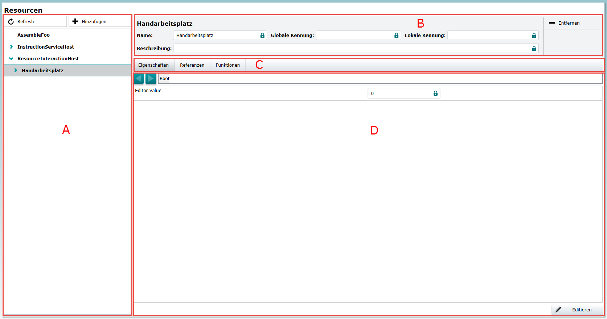

---
uid: ResourceManagementUI
---
# Resources

By default the resource management comes with a graphical UI shown in image below. The UI accesses the resource graph over a web-service hosted by the default implementation of IRootResource. The UI visualizes a resource tree on the left and a details view with aspects of a resource on the right. The web-service as well as the UI is optional and can easily be removed or replaced by applications.



* Region A shows the resource tree
* Region B shows some general details which are part of the master view and fix for any detail views
* Region C shows all configured aspects of a resource
* Region D contains the details from an aspect selected in region C

## Resource Tree

The resource tree contains all currently available resources. 
The details of a resource, which contain all information for the available aspects, will be loaded by selecting it. 
There is the possibility to refresh the tree in the upper left corner to get for example new created resources. 
There is also the posibility to add new resources. 
Clicking the Button will open a dialog which provides a type tree.
This tree is filtered with respect to the assignable types of the selcted resource when clicking the button.
All matches and their derived types are included in the type tree. 
That way the user can only add resources that are actually compatible and the risk of misconfiguration is eliminated.

If the creation of a resource requires parameters or if it can be created in different ways, developers can define constructors. 
Two examples for resource constructors are shown in the snippet below.

```cs
public class MyResource : Resource
{
    [ResourceConstructor(IsDefault = true)]
    public void DefaultConstructor()
    {
        Named("Test");
    }

    [ResourceConstructor] 
    public void Named( string name)
    {
        Name = name;
    }
}
```

Because of the IoC approach and C#´s inability to split object creation and constructor invocation, resource constructors are implemented as methods with the [ResourceConstructor](xref:Moryx.AbstractionLayer.Resources.ResourceConstructorAttribute)-attribute. 
That way, the [ResourceManager](xref:Moryx.Resources.Management.Resources.ResourceManager) can create the instance, wire all framework components and reference properties before invoking the constructor method. 
This makes it possible for developers to use the full feature set of the `AbstractionLayer` within the constructor.

## General Details

There is some general information of a resource which is displayed as part of the master view.
So it will be visible in all cases even if there is a custom details view selected. 
There is also a small area for buttons which in the example only contains the `delete` button, which will delete the selected resource. 
After selecting a resource the UI will open its details view.

Some information is build on the platforms `Entry` format. 
The `EntryFormat` is an enhanced, recursive key-value structure. 
It is designed to serialize types or objects and edit or instantiate them on the client, without knowledge of the concrete type. 
It is an important tool of the platform to easily add resources or other plugins on the server without the need for a new web-service or specialized UI. 
Developers can decide which properties should be visible by decorating them with the `EntrySerialize` attribute.
In many cases properties will be decorated with `DataMember` and `EntrySerialize` to save modified values, but splitting them allows for special cases.
Using only `DataMember` lets developers save values without giving the user access and using only `EntrySerialize` lets users edit runtime values that should not be saved.

The default version of the details view with its [Aspect](ResourceManagementUI.md#Aspects) is sufficient for many resources and helps developers to get started quickly. 
If this default does not match your requirements, it can be easily replaced with a custom UI.
To implement and register a custom view, a class has to derive from the [ResourceDetailsViewModelBase](xref:Moryx.Resources.UI.Interaction.Details.ResourceDetailsViewModelBase) class that is registered for a server side [Resource](xre:Moryx.AbstractionLayer.Resources.Resource) type like shown below.

```cs
// On the server
public class Custom : Resource
{
    [EntrySerialize]
    public SomeEnum EnumValue { get; set; }
}

// On the client
[ResourceDetailsRegistration("Custom")]
public class CustomDetailsViewModel : ResourceDetailsViewModelBase<CustomViewModel>
{
}
```

The string given in the registration is the name of the class on the server. 
The registration is not limited to an exact type match but will also apply to all derived types unless a more concrete details view model is registered. 
With this registration the resource UI will create an instance of the view model and its associated view.
The custom details view also references a `CustomViewModel` in the generic argument of the base class.
This view model is used to map the server side properties transmitted in the `Entry` format.

```cs
public class CustomViewModel : PropertyChangedBase
{
    [ConfigKey("EnumValue")]
    public string Value { get; set; }

    public string [] PossibleEnumValues { get; set; }
}
```

The code for the custom view model declares two properties. 
One representing the current `Value` of the enum property and the other contains all members declared on the server side.
Per default, properties of the view model class are mapped automatically, optionally the `ConfigKey` attribute can be used. 
The automatic property mapper detects properties that should be filled with values based on the `ConfigKey` attribute or by using a naming convention like in the example. 
Custom view models are not limited to flat objects with strings. 
The mapper also performs the type conversion for example for numeric values and can even map to class properties if they exist in the view model. 
If the server side object declares a collection, they are mapped to a specialized collection of type `EntryCollection<T>` where `T` is the type of view model entries. 
Building a user friendly custom view will always mean more effort and thereby require more work than the default view.
But with the availability of the Entry-mapper and reusable controls building a custom view requires only a few lines of code.


### Properties

The `Properties` aspect will show all available configurable properties of a resource. It can be changed only in the Edit-Mode.

### References

The `Reference` aspect shows all possible references of the selected resouce. 
Every resource has a `Parent` reference. It can be used to reorder resources in the whole tree. 
Each reference gets an indicator if the reference is currently linked to another resource or not. 
All possible resources for a reference can be shown by selecting the reference. 
The currently linked resource has and identical indicator to show their connection. 
There are two buttons at the bottom of the aspect to link or unlink a resource. 
Each reference can be a single- or a multi-reference. 
A single-reference can only be linked to one resource. 
A multi-reference can be linked to more then one resources.

### Methods

To interact with a resource, it is possible to provide an additional web-service. 
An alternative is to decorate a method with the `EntrySerialize` property.
This will automatically lead to an entry in the method aspect. 
After selecting a method, it is possible to enter values and inspect the returned value after invoking the method. 
Like the details view this feature uses the platforms `Entry` format and editor to serialize, transmit and visualize the methods parameters. 
It also includes features like the dropdown-box for enum parameters. 

Invoking methods via this UI allows manual tests to be executed without additional coding effort. 
This aspect is independet from the `Edit Mode` and the methods can be called at any time.
