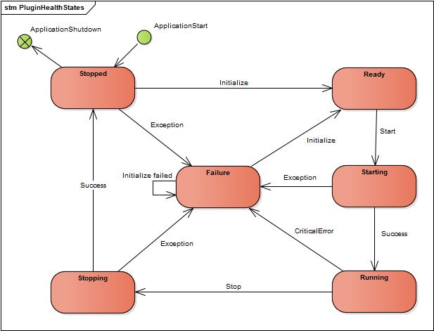

# LifeCycle

From the beginning the Runtime was designed to offer a managed and restartable lifecycle. Unlike "normal" applications the Runtime does not boot the modules only once but rather decouples its own lifecycle from the modules. The standard module lifecycle is represented by the following state machine. Please note that this chapter is based on the assumption that your module inherits from ServerModuleBase. It is possible to implement IServerModule yourself but  it is not recommended and in this case you are on your own. During each transition the ServerModuleBase will perform a couple of operations for the derived module instance.



## Transitions

Inherited from the base class, each server module has the three transitions: `Initialize`, `Start` and `Stop`. Each of the three state transitions are defined by four phases and the state changes. When the kernel calls one of the public transition methods the modules state machine will first check if this transition is valid. If a valid transition was started control is returned to the module. The next phase contains the base classes pre-operations. After the pre-operations the `OnEnter` is called. The final phase contains post-operations implemented in the base class as well. Pre- and post-operations might be as simple as logging the transition or as complex as building the local container.

## Initialize

Initialize can be seen as a modules repeatable constructor. During this transition the config is fetched and parsed, plugins and dependencies are registered in the local container and passive component structures can be instantiated. Initialize does not respect the declared dependency order. It is therefor not permitted to access other module APIs. Its 3 phases contain the following operations:

**Pre-Operations:**
The initialize pre-operations load the modules config and look for container relevant entries like [ModuleStrategy](xref:Moryx.Runtime.Configuration.ModuleStrategyAttribute). In the next step the logging is activated and the local container is build.

| Step | Operations |
|-------|------------|
| 1. | Fetch config |
| 1.1 | Parse config and look for strategies |
| 2.  | Activate logging |
| 3.  | Create local container |
| 3.1 | Execute AutoInstaller for the modules executable |
| 3.2 | Register ErrorReporting, ParallelOperations and ConfiguredHostFactory |
| 3.3 | Register Config and Logger instance |

**User Operations:**
The method `OnInitialize()` defines the module specific user operations. Normally those operations include registering global components into the local container and loading plugins. A sample `OnInitialize()` may look like this:

````cs
protected override void OnInitialize()
{
    // Register dependencies
    Container.SetInstance(MyDependency);
    Container.SetInstance(MyModel, MyModelConstants.Namespace);

    // Load plugins
    Container.LoadComponents<IMyPlugin>(); // from AppDomain
    Container.LoadComponents<IMyPlugin>(Config.PluginDir); // from Directory
}
````

**Post-Operations:** During registration in the previous phase the container might encounter a number of [SubInitializers](xref:Moryx.Container.ISubInitializer). They can only be executed after all other components were registered. Therefor they are executed in this phase once all user code has completed.

## Start

During the start transition the module enters its running state. This means the composition is instantiated, timers and threads started and external communication established. Start is invoked only if all dependencies have already reached the running state. Access to other modules APIs is now permitted.

**Pre-Operations:** Short log entry.

**User Operations:** The `OnStart()` method defines module specific operations to instantiate the modules composition and start its execution. This includes starting components/plugins and activating the WCF and Facade API. This might look like this:

````cs
protected override void OnStart()
{
    // Register dependencies
    Container.Resolve<IMyPlugin>().Start();

    // Activate WCF
    _host = Container.Resolve<IConfiguredHostFactory>().CreateHost<IUserManagementService>(Config.HostConfig);
    _host.Start();

    // Activate facade
    ActivateFacade(_facade);
}
````

**Post-Operations:** Short log entry.

## Stop

The stop transition represents the modules shutdown. External communication is closed, facades deactivated and timer and threads stopped. As the last step the local container is destroyed and all components within are disposed. Eventually the GarbageCollector will free all allocated memory and there is no trace of the previous life cycle.

**Pre-Operations:** Log entry of stopping module.

**User-Operations:** Close connections and deactivate facades.

**Post-Operations:** Destroy container and remove references.