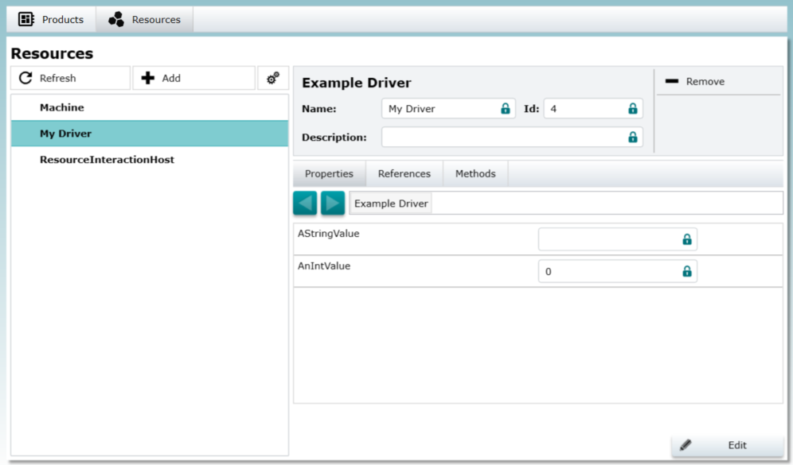

# How to build a driver

A driver is the interface between other Resources and physical parts of the modelled system. This tutorial shows how a driver should be implemented.

## Basic driver files

A driver has this basic solution structure which can be extended for your needs:

````fs
-Moryx.Driver.ExampleDriver
|-IExampleDriver.cs
|-ExampleDriver.cs
````

The interface `IExampleDriver` is the API of the driver and important for registration within the AbstractionLayer. For compatibility and reduced dependencies it is based to use an existing driver interface or suggest adding an additional driver interface.

### The interface

This interface is simply derived from [IDriver](xref:Moryx.AbstractionLayer.Drivers.IDriver). No further definitions are needed.

````cs
using Moryx.AbstractionLayer.Drivers;

namespace Moryx.Resources.Samples.DriverTutorial
{
    public interface IExampleDriver : IDriver
    {
    }
}
````

### The implementation

Now implement `IDriver`:

````cs
using System.ComponentModel;
using System.Runtime.Serialization;
using Moryx.AbstractionLayer.Drivers;
using Moryx.AbstractionLayer.Resources;
using Moryx.Serialization;

namespace Moryx.Resources.Samples.DriverTutorial
{
    [ResourceRegistration]
    [DisplayName("Example Driver"), Description("An example driver")]
    public class ExampleDriver : Driver, IExampleDriver
    {
        [DataMember, EntrySerialize]
        public string AStringValue { get; set; }

        [DataMember, EntrySerialize]
        public int AnIntValue { get; set; }

        public string ANonEntrySerializeMember { get; set; }

        [EntrySerialize, DisplayName("Square"), Description("Just multiplies given value with itself")]
        public int Square(int value)
        {
            return value * value;
        }
    }
}
````

The implementation of the `ExampleDriver` derives from the [Driver](xref:Moryx.AbstractionLayer.Drivers.Driver) base class. It also implements the `IDriver` interface. The next important thing is the [ResourceRegistration attribute](xref:Moryx.AbstractionLayer.Resources.ResourceRegistrationAttribute). The AbstractionLayer can now identify this driver as a resource. Additional attributes like `DisplayName` and `Description` are used within the Resource UI.



The two properties `AStringValue` and `AnIntValue` are shown in the ResourceUI and can be edited by the user. The member `ANonEntrySerializeMember` is invisible for the user and is only used inside the AbstractionLayer.
The `Square` function is also visible in the Resource UI. And: It is callable from there.

## Additional things that are good to know

The `ExampleDriver` is just a simple implementation for a driver. As like every [Resource](xref:Moryx.AbstractionLayer.Resources.Resource) you can `Initialize`, `Start`, `Stop` a driver. Also `State machine` support is built in:

````cs
using Moryx.AbstractionLayer.Drivers;
using Moryx.AbstractionLayer.Resources;

namespace Moryx.Resources.Samples.DriverTutorial
{
    [ResourceRegistration]
    [DisplayName("StateExample Driver"), Description("An example driver that uses the state machine")]
    public class StateExampleDriver : Driver, IExampleDriver
    {
        ...

        /// <seealso cref="IDriver"/>
        public override void Initialize()
        {
            base.Initialize();

            StateMachine.Initialize<ExampleStateBase>(this);
        }

        ...
    }
}
````

## When to use a driver

If you want to communicate with the outside world like a database , a PLC, RFID scanner or bar code reader you should implement it as a driver.