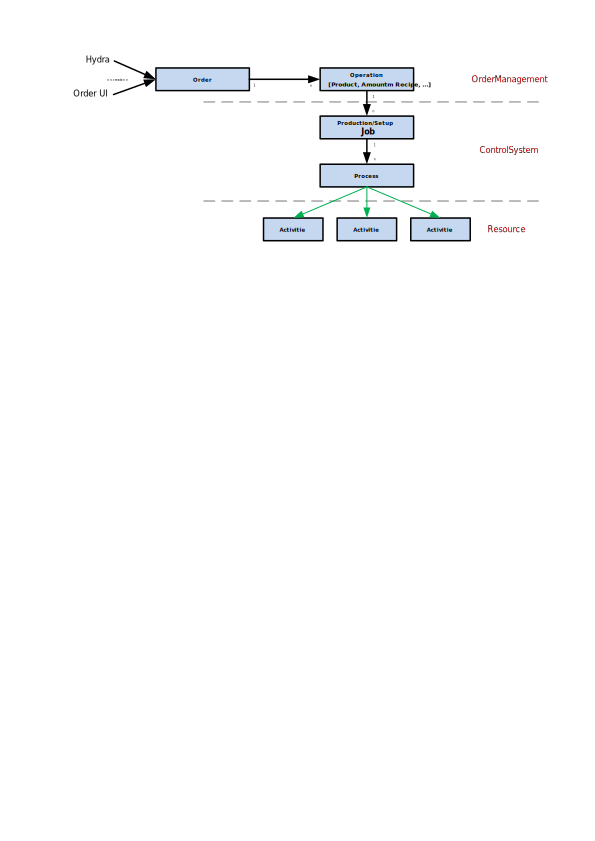

# ControlSystem

The goal of the ControlSystem is to fulfill the SCADA layer of the automation pyramid. To give a brief introduction the layer of the automation pyramid are described.

The classic automation pyramid model shows a series of well-defined layers structured in such a way that information flows upwards from devices to enterprise via levels of control, supervision and management.


- The first level or *field level* comprises the physical devices existing in industry such as actuators and sensors.
- The second level or *control level* includes logical devices such as PCs, PLCs, PIDs, etc.
- The *supervisory level* (third level) corresponds to control and data acquisition systems (SCADA).
- The manufacturing execution systems or MES are at a higher level or *planning level*.
- The top of the pyramid (*management level*) is comprised of the company's integrated management system (ERP) e.g. SAP.

The main goal of this document is to give an overall understanding of the concept of the ControlSystem which is build on the frameworks foundation and the AbstractionLayer. The concept involves the description of `Orders`, `Operations`, `Jobs`, `Recipes`, `Processes` and `Activities`. Also the communication with `Resources` out of the AbstractionLayer will be shown.


## Orders and Operations

Orders or more specific *Production Orders* in the ControlSystem are strongly related to the concept in the ERP System *SAP*.

> A production order specifies which material is to be produced, where it is to be produced, which operations are required to do this and on which date production is to take place. It also defines how the order costs are to be settled. [[ref](https://help.sap.com/saphelp_me60/helpdata/EN/21/3e8c53f894ee23e10000000a174cb4/frameset.htm)]

The ControlSystem adopts the Orders more simplified as the ERP or MES system does because of the position within the automation pyramid. For the ControlSystem it is not necessary to know anything about planning, production dates or the location where the order will be executed. It only gets the advise from the MES system to produce a amount of materials. Therefore an Order in the ControlSystem context is only known by the *OrderNumber*. The Order itself does not have an *Amount*.

As described Orders consists of multiple Operations for the final material. Operations can be for example *Assemble*, *Soldering* or *Packaging*.

````text
Order 1<----->n Operations
````

Because of the reason that orders has no quantity operations holds this information. It is possible to produce more materials than given as quantity, the Operation also have the possibility for *Under- and Overdelivery*. These tolerances are defined to control percentages and quantities delivered in the process. Under-deliveries are seen as partial deliveries and are usually allowed, as they do not exceed a defined quantity. [[ref]](https://wiki.scn.sap.com/wiki/display/ERPSCM/Under+and+Overdelivery+Tolerances+in+Purchasing)

### OrderManagement

Within the ControlSystem the order and operation behavior is managed by a `ServerModule` named [OrderManagement](xref:OrderManagement). It is an own module because the responsibility of managing orders and operations is completely isolated. This includes the responsibility for ...

- Providing Orders including Operations and their changes to the UI
- Accepting created Orders and Operations by the user
- Adding product and material related data to an Operation
- Choosing the recipe and adding order specific data for the production
- Validation
- Providing access to the ProcessEngine
- Providing persisting abilities for Operations.
- Accepting Orders and Operations from the MES and reporting of progress updates

An Operation within the OrderManagement consists of the following properties (some technical properties are neglected):

| Property | Description |
|----------|-------------|
| Name | Used to give a short description |
| Number | Identifier which is normally 4 numerical digits long (e.g. 0010) |
| Product | Product to produce |
| Recipes | Recipes which should be used for production |
| TotalAmount | Amount of repetition for the Operation |
| OverDelivery | Percentage tolerance for over delivery (e.g. 1.1) |
| UnderDelivery | Percentage tolerance for under delivery (e.g. 0.9) |

In some production areas the separation of Orders and Operations is not necessary. Because of this, it is very common that an Order is only related to one Operation.

**Sources:** The OrderManagement can have multiple sources where orders and operations can be received. The module provides a plugin structure to extend these sources. The default source will be represented by MES. Also very common is OrderManagement WPF UI for testing purposes or as fallback if other sources does not work.

**User Interface:** The ui of the order management will be used to show all orders to produce on the current machine.


### Relation to the ProcessEngine

The OrderManagement is directly connected to the ProcessEngine which is responsible for the whole process execution. The OrderManagement can advice the ProcessEngine to produce an amount of materials. The only entities which are needed for it are a production recipe and the amount which are requested. Recipes defines the parameters and workplans to achieve a certain result similar to a cooking recipe. The result of an execution of the recipe is usually an article (or material).

The ProcessEngine will use this information and creates abstract production jobs for it. This can be one or multiple which depends on the request of the OrderManagement.

````text
Operation 1----->n ProductionJob
````

Because of the abstraction, the ProcessEngine does not know anything about orders or operations. The relation is only known within the OrderManagement.

## Recipes

As already implied a recipe defines the parameters and workplans to achieve a certain result similar to a cooking recipe. The general and abstract description can be found in the `FrameworkLayer AbstractionLayer`. Currently there are these specialization of recipes:

- `Product Recipes` are used to produce products with a workplan. Its parameter is the description of the product to be produced.
- `Setup Recipes` are used to setup the facility. They contain parameters and a generated workplan with tasks to be done.

### Cooking Recipe Sample

Lets make a real comparison to a cooking recipe. First a general description  will be given.

A cooking recipe is a set of instructions that describes how to prepare or make something, especially a culinary dish. Modern culinary recipes normally consist of several components which will be compared to the ControlSystem usage in the following table:

| Cooking Recipe | Production Recipe |
|----------------|-------------------|
| The name of the dish | Short description of the production recipe e.g. `Production of 439849-01 without soldering` |
| How much time it will take to prepare the dish | That is currently not used |
| The required ingredients along with their quantities or proportions | This will derived from the product which is a property of the production recipe |
| Necessary equipment and environment needed to prepare the dish | This information can be derived from the referenced workplan in the production recipe. Each task can be mapped to the facility over capabilities. |
| An ordered list of preparation steps and techniques | This is the workplan |
| The number of servings that the recipe will provide (the "yield") | This information will not be written to the recipe. It is part of the ControlSystem jobs |
| Flavor | The flavor can be reached by additional properties which can be added as an extension to the default product recipe |
| A photograph of the finished dish | This is part of the product which is a property of the production recipe |

It can be implied that for each product within the ControlSystem a special recipe exists how it can be produced with the facility. Properties of a production recipe are (some technical properties are neglected):

| Property | Description |
|----------|-------------|
| Name | Used to give a short description |
| Revision | Defines the version of the recipe |
| State | e.g. New, Released, Revoked |
| Classification | e.g. Default, Alternative, Clone |
| Workplan | Reference to the workplan with steps to produce the product |
| Product | Product to produce |

In most cases the facility needs to know some additional information from orders or operation. As described, the ControlSystem does not know anything about it. So the recipe is the best place to put some additional properties. As an example, the facility mostly needs the current number of the order. The ControlSystem provides a additional implementation derived from the product recipe with for example the number of the order and operation called `OrderBasedRecipe`.

To make the sample complete a production of a bread will be described. Think about your facility (maybe a kitchen):

- Oven (Capabilities: Temperature 50-200 celsius degree, Type UpperHeat, CirculatingAir)
- Mixer (Capabilities: Mix a volume of 1,5 liters)
- Teaspoons (Capabilities: Grab 5 milliliters)
- Knife (Capabilities: Cutting Types: Bread, Meat)
- Cup (Capabilities: Capacity 200 milliliters)
- Bowl (Capabilities: Capacity: 2 liters)

These are our tools which can be used to produce a simple bread. To do it, we need some ingredients for example a simple farmers bread:

- 2 cups all-purpose flour
- 1 1/2 teaspoons salt
- 1/2 teaspoons instant (rapid-rise) yeast
- 2/3-1 cup water, room temperature
- 1/3 cup whole or 2% milk, room temperature

For the production of the bread we need a recipe which matches our ingredients and our available facility (kitchen). Lets have a look on our recipe properties. The name is quiet simple `Farmers bread`. More important is the product description which is described with ingredients and a workplan for our facility (kitchen). additional recipe properties which are needed:

| Property | Description | Value |
|----------|-------------|-------|
| Product | Product to produce | FarmersBread-1 |
| Workplan | Reference to the workplan with steps to produce the product  | See image below |
| BakingTime | Time for the oven |  1 hour |
| BakingTemperature | Temperature for the oven |  200 degree celsius |
| BakingType | Baking type e.g. UpperHeat, CirculatingAir | CirculatingAir |
| SittingTime | Time to sit after adding ingredients | 8 hours |
| SittingTemperature | Temperature for sitting | 20 degree celsius |
| MixerTime | Time for the mixing process | 20 minutes |
| MixerSpeed | Speed for the mixer | 200 rounds per minute |
| SliceThickness | Thickness for the slices | 1 centimeter |

The workplan is quiet simple. All ingredients will be put into the mixer bowl. After that, the bowl will be covered and have to sit. After the sitting process, more ingredients will be added and mixed. If the base for the bread is ready, it have to be baked. To serve it, it have to be sliced.


With all these information and tools a worker can bake the farmers bread. Please note that it is very important to do not mix the product description and the recipe. On another kitchen, the recipe can be another version for example the workplan can be another with merged or more extended steps or the oven have other capabilities (e.g. no capability to bake with circulating air).

## Jobs

With the production recipe and amount, the [ProcessEngine](xref:ProcessEngine) can execute the referenced workplan for a defined amount of times. Jobs will be created for this pair. They will be handled by the ProcessEngine part [JobManagement](xref:ProcessEngine.JobManagement).

A job is the smallest independently assignable work order within the ControlSystem which knows currently two types:

- `Production Job`
  A production job is usually the most common type. It is used to produce products according to the product description provided by the production recipe.

- `Setup Job`
  A setup job will be created by the [SetupManagement](xref:ProcessEngine.SetupManagement) to change the setup of the facility. It compares the required setups with the facility and creates setup jobs between them if needed.

Jobs are unchangeable. This means later changes of job information (e.g. amount, recipe properties) is not possible and also not desired. Jobs are more seen as *throw away* entities. So whenever the amount have to be adjusted a new job will be created with the additional amount. If the recipe information should be changed, production jobs have to be completed or aborted so that jobs with the new information can be created.

When a job is executed, it lets the ProcessController create a series of processes depending on the amount and type given with the job.

````text
Job 1<----->n Process
````

To decide if a job is finished, the JobManagement registers for ProcessController's events and counts all events saying that a process was finished, separated for successful and failed ones.

## Processes

The *process* will be used to create a series of *activities* out of the workplan which are executed by *resources* one by one. This behavior is handled by the ProcessEngine part [ProcessController](xref:ProcessEngine.ProcessController).

- For production jobs, each process produces exactly one *product*. If the process is interrupted for some rework after a failure, there will be a new process, but there will never be two articles produced by one process.
- For setup jobs there only exists one process with a workplan to setup the machine for another product type. Processes are instantiated from recipes and keep a reference to their recipe throughout their life cycle.

````text
Process 1<----->n Activities
````

## Activities

Activities are instructions given to a resource. An activity defines parameters and required capabilities. An activity is supposed to be an abstract operation like Insert Part, Assign Serial or Open Shades rather than concrete actions like setting the value of an actuator. The resource is responsible to translate the instruction into concrete actions.

In order to execute an activity, a [cell implementation](CellResource.md) is selected which is capable to perform the activity.
In addition to the capabilities a cell selector can be used to fine tune the otherwise first-come-first-serve selection of the process engine.

- [Cell implementation](CellResource.md): Implement a cell resource and interact with the process engine 
- [Cell selection](CellSelector.md): Learn how to customize the selection of an activities targets

## Notifications

The major components of the ControlSystem and AbstractionLayer are capable to publish Notifications. Notifications will be used to mainly inform the user about information, errors and also warnings. When ever the facility have a problem or information the user will be informed.

The [NotificationPublisher](xref:NotificationPublisher) collects these user based notifications from the components and handles them. The responsibility of this component is to store, publish to clients and acknowledge notifications.

## Big Picture

With all the described sections in this document a big picture of the ControlSystem layer turns out with the following major ServerModules and separations:

- [OrderManagement](xref:OrderManagement)
- [ProcessEngine](xref:ProcessEngine)
- [NotificationPublisher](xref:NotificationPublisher)


The following picture shows the flow of information from an order to a single activity handled by some resource.


