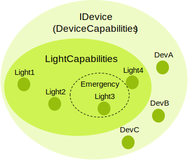

# Capabilities

[Capabilities](/src/Moryx.AbstractionLayer/Capabilities/ICapabilities.cs) are based on the idea of [set theory](https://en.wikipedia.org/wiki/Set_theory). Each class with its attributes and functions describes a set. Within MORYX, modules can use required capabilities to describe a set and fetch resources from the `ResourceManagement` that fullfil the membership function, which are part of that set. [Resources](/docs/articles/module-resources/index.md) can export their capabilities to be matched against the required capabilities. Every [Activity](Activities.md) defines which capabilities it needs and the provided information will be used to find a matching Resource to handle the activity. It is also possible that a resource has multiple capabilities and is able to handle various activities.



## Single Capabilities

Just implement the interface to define a capability like in the example:

```` cs
[DataContract]
public class MyCapabilities : ICapabilities
{
    public bool IsCombined => false;

    public bool ProvidedBy(ICapabilities provided) => provided is MyCapabilities;

    public bool Provides(ICapabilities required) => required is MyCapabilities;

    public IEnumerable<ICapabilities> GetAll()
    {
        yield return this;
    }
}
````

It is also possible to use the base class [CapabilitiesBase](/src/Moryx.AbstractionLayer/Capabilities/CapabilitiesBase.cs), which reduces the code to the following lines:

```` cs
[DataContract]
public class MyCapabilities : CapabilitiesBase
{
    protected override bool ProvidedBy(ICapabilities provided) => provided is MyCapabilities;
}
````

In any case you can extend your capabilities with more properties to give the resource are more meaningful self description. Let's take the ScrewingCapabilities as an example. Maybe there is more than one station which has ScrewingCapabilities but each can handle a different screw head. Our Capability implementation could then look like:

```` cs
public enum ScrewHead
{
    Default, 
    Phillips
}

[DataContract]
public class ScrewingCapabilities : CapabilitiesBase
{
    [DataMember]
    public ScrewHead Head { get; set; }

    /// <summary>
    /// Default constructor
    /// </summary>
    public ScrewingCapabilities()
    {    
    }

    /// <summary>
    /// Initializes a new instance of the <see cref="ScrewingCapabilities"/> class.
    /// </summary>
    public ScrewingCapabilities(ScrewHead providedHead)
    {
        Head = providedHead;
    }

    protected override bool ProvidedBy(ICapabilities provided)
    {
        var capabilities = provided as ScrewingCapabilities;
        return capabilities != null && capabilities.Head == Head;
    }
}
````

So it is possible to extend a Capability with different information to distinguish between resources with the same capabilities.

## Multiple Capabilities

A resource can also have multiple capabilities. For that the [CombinedCapabilities](/src/Moryx.AbstractionLayer/Capabilities/CombinedCapabilities.cs) class should be used, which implements the ICapabilities interface as well. In set theory `CombinedCapabilities` represent unions or intersections depending on whether they are used as required or provided capabilities:

```` cs
// some resource code

public override void Initialize()
{
    base.Initialize();

    Capabilities = new CombinedCapabilities(new List<ICapabilities>
    {
        new MyCapabilities(),
        new ScrewingCapabilities(ScrewHead.Phillips),
        new CoolCapabilities(),
        new HotCapabilities(),
        new LitCapabilities()
    });
}

// some more resource code
````
