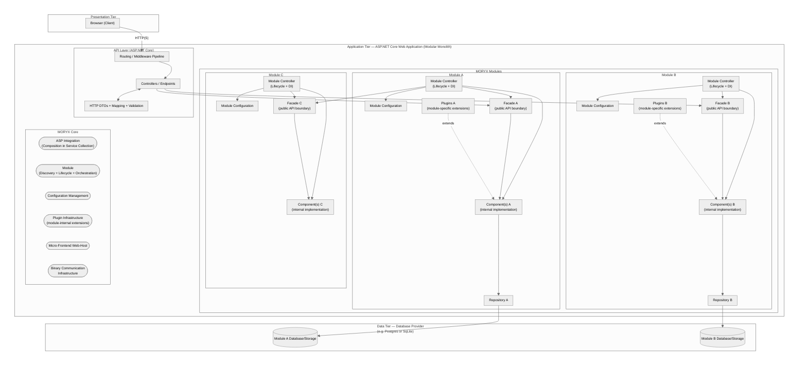

# MORYX Architecture Design Guidelines

This document depicts the core architectural concepts in MORYX and how they fit together.
Use it as a concise guide for choosing the right building block and for applying consistent patterns across modules and applications.

## Overview diagram

## Fundamental principles

- [Modular Monolith](https://awesome-architecture.com/modular-monolith/) with clear module boundaries.\
[Modules](#modules) encapsulate functionality and expose a stable API via facades.
- Two-level DI and lifecycle.\
The *Level-1 composition* lives in the [Asp.Net Core Service Container](https://learn.microsoft.com/en-us/aspnet/core/fundamentals/dependency-injection?view=aspnetcore-10.0) and holds facades for the app lifetime.\
The *Level-2 composition* is per-module and rebuilt on start/stop by a module's Module Controller, enabling restart and reconfiguration without process restarts.
- Inter-module communication via facades only.\
*Never* couple modules through internal services or database tables.
- Configuration and plugins first-class.\
Use configuration to shape a module’s composition and plugins to extend behavior at runtime.
- Data ownership per module.\
Persist data through module-owned repositories and storage. *Avoid* cross-module database access.
- Thin endpoints and web-UI.\
Keep technology-specific concerns (HTTP, MQTT, UI) outside the module; map DTOs at the edges and keep business logic inside modules.

## Key concepts and guidelines

### Modules

- **Purpose:** Reusable, cohesive business capability. Owns its data, configuration, composition, and lifecycle.
  - Public API: Exactly one [facade](#facades) that defines the module boundary. Treat facade interfaces as contracts.
  - Composition: [Components](#components) and [plugins](#plugins) (optional) wired together by the ModuleController.
  - Lifecycle: start, stop, restart on failure or configuration change. On restart, the facade retains identity while its internal references are refreshed.
- **Guidelines:**
  - Keep business logic inside components; keep facades thin and intention-revealing.
  - Avoid static/global state; prefer DI-managed services with clear lifetimes.
  - Validate configuration at start; fail fast with actionable diagnostics.

### Facades

- **Purpose:** Stable, technology-agnostic boundary for consumers (endpoints, other modules).
- **Guidelines:**
  - Provide coarse-grained operations aligned with business use-cases.
  - Use domain models internally; map to DTOs at endpoints instead of polluting the facade with transport concerns.
  - Prefer async APIs; design for idempotency where it matters.
  - Evolve additively; deprecate before removal. Maintain backward compatibility for consumers where feasible.

### ModuleController

- **Purpose:**: Composition root for the module. Wires level-2 DI, owns configuration, controls start/stop, and exposes the facade instance to level-1.
- **Responsibilities:**
  - Construct components and plugins based on configuration.
  - Manage lifecycle and recovery.
  - Ensure system-compliant facade reference updates across restarts.

### Components

- **Purpose:** Internal services implementing the module’s business logic.
- **Guidelines:**
  - Define clear interfaces to aid testing and plugin substitution.
  - Keep them cohesive; split by responsibility, not by technical layers.
  - No external technology dependencies (HTTP, UI, device SDKs) directly; wrap such concerns behind ports/adapters.
- [Further Reading](https://github.com/PHOENIXCONTACT/MORYX-Home/tree/main/development/architecture/components.md)

### Plugins

- **Purpose:** Module-internal extensions selected and configured at runtime (e.g., strategy, algorithm, provider).
- **Guidelines:**
  - Define explicit plugin contracts and lifetimes.
  - Keep constructors light; prefer configuration objects and late initialization.
  - Validate compatibility and handle missing or misconfigured plugins gracefully.

### Endpoints

- **Purpose:** Make a module’s facade accessible to other processes via a transport protocol (e.g., REST HTTP, MQTT).
- **Characteristics:**
  - Passive: They do not actively drive workflows; they expose operations for external callers.
  - Responsibilities: Request/response mapping, validation, authentication/authorization, error translation, observability.
  - Do not implement business logic. Delegate to the module’s facade.
- [Further Reading](https://github.com/PHOENIXCONTACT/MORYX-Home/tree/main/development/architecture/endpoints.md)

### Adapters

- **Purpose:** Integrations that actively interact with external IT systems (e.g., SAP, Teamcenter). Technically identical to modules but driven by external workflows.
- **Guidelines:**
  - Isolate vendor SDKs and protocols. Implement retry, circuit breakers, and backoff.
  - Translate external models to internal domain models near the boundary.
  - Schedule/poll/subscribe as needed; keep orchestration separate from business rules in components.

### Web-UIs

- **Purpose:** Micro front-ends hosted by the MORYX Launcher to provide user-facing functionality.
- **Guidelines:**
  - Consume existing endpoints where feasable; Define dedicated endpoints where the benefit of server-side logic or custom DTOs would outweigh the additional maintenance and development effort.
  - Map DTOs to view models; implement paging, filtering, and optimistic UI patterns.
  - Keep UI stateless where possible; persist long-running state in modules.

### Resources and Drivers

While actually scoped within the [Resource Management Module](/docs/articles/module-resources/index.md) they are the most prominent kind of plugin in the whole Framework and hence mentioned here.

- **Purpose:**
  - [Resources](/docs/articles/module-resources/Types/overview.md): Digital twins of assets (machines, stations, etc.) in an application.
  - [Drivers](/docs/articles/module-resources/Types/driver-resource.md): Technology-specific implementations that connect resources to physical devices.
- **Guidelines:**
  - Separate resource behavior (domain) from driver concerns (protocols, IO, timing).
  - Model lifecycle and status explicitly; make use of the [state machine pattern](../framework/index.md#state-machine), if apropriate.
  - Use references to bind resources to drivers and hardware.

### Repositories and data access

- Each module owns its repository/DB schema. Use transactions where needed and keep migrations module-scoped.
- Never introduce cross-module joins or shared tables. Communicate through facades instead of the database.
- Map domain entities to persistent models within the module boundary.

### Edge mapping and DTOs

- Endpoints perform mapping between transport DTOs and the module’s domain models.
- Validate and normalize input at the edge; return meaningful error codes and [problem details](https://learn.microsoft.com/en-us/aspnet/core/fundamentals/error-handling-api?view=aspnetcore-10.0&tabs=minimal-apis#problem-details).

### When to choose what

- Choose a module when you need a cohesive business capability with its own data and lifecycle.
- Choose a resource (with drivers) when modeling or controlling a physical asset.
- Choose an adapter when you must actively integrate with an external IT system.
- Choose an endpoint to expose a module’s operations to other processes or UIs.
- Build components and plugins inside modules to structure logic and enable runtime variability.
