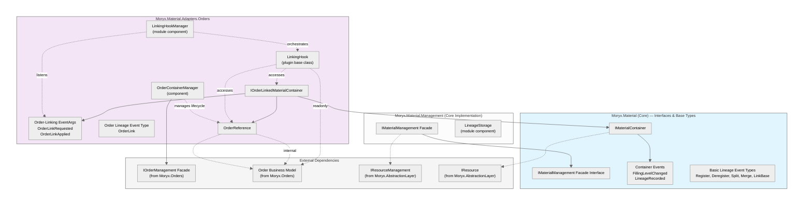
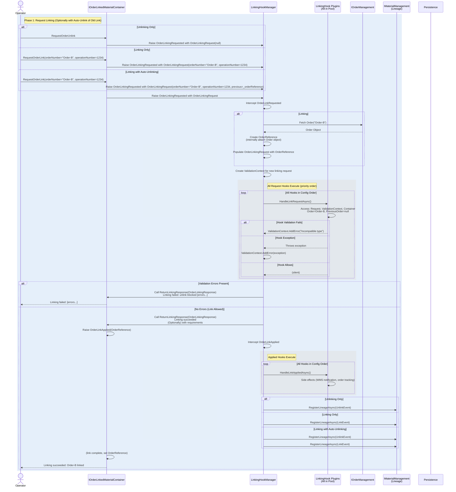

# Material Management Module Architecture

## Overview

The Material Management system is organized in **layered packages** with clear separation between core material operations and domain-specific adapters. Each layer adds functionality without polluting the core abstraction.



---

## Layer 1: Core Material Management (`Moryx.Material`)

### `IMaterialContainer : IResource`

**Inheritance:**
- Extends `IResource` (Id, Name, Capabilities)

**New Properties:**
- `decimal Quantity` — Current filling level / material amount
- Other material-specific attributes TBD

**Events:**
- `event EventHandler<FillingLevelChangedEventArgs> FillingLevelChanged`
- Other container state change events TBD

**Purpose:**
Provides a unified abstraction for any container holding material. Can be extended by domain-specific adapters without modifying core.

---

### `IMaterialManagement` Facade

**Operations:**
- Container lifecycle (Create, Register, Delete, Get)
- Lineage events (Split, Merge, UnlinkOnRefill)
- Material flow interactions (TBD: detailed list)

**Events:**
- Container registration, deletion, state changes

**Purpose:**
Central coordination point for all material management operations and external integration (WMS, ERP sync).

---

## Layer 2: Order Adapter (`Moryx.Material.Adapters.Orders`)

### `IOrderLinkedMaterialContainer : IMaterialContainer`

**Inheritance:**
- Extends `IMaterialContainer`

**New Properties:**
- `OrderReference? LinkedOrder` — Reference to linked order (can be null)

**Events:**
- `event EventHandler<OrderLinkRequestEventArgs> OrderLinkRequested`
  - EventArgs contains `OrderLinkingRequest` with:
    - Order number
    - Operation number (optional)
  - Fired when user/automation initiates a link attempt

- `event EventHandler<OrderLinkAppliedEventArgs> OrderLinkApplied`
  - EventArgs contains applied OrderReference
  - Fired after linking is validated and accepted

**Purpose:**
Extends IMaterialContainer with order-specific linking semantics. Containers can now declare they're order-capable without requiring the order object directly.

---

### `OrderReference`

**Visibility:** Internal property within `IOrderLinkedMaterialContainer`

**State Machine:**
```
[Initialized] → [Active] → [Inactive]
             ↘          ↗
               [Unavailable]
```

- **Initialized**: Order information (order#, op#) available; business object not yet resolved
- **Active**: Order business object is set and accessible from internal property; properties mapped to public getters
- **Inactive**: Order business object deliberately removed (e.g., during adapter shutdown); reference remains valid
- **Unavailable**: Order lookup failed (order doesn't exist in system); reference should be discarded or re-attempted

**Properties:**
- `(internal/private) Order _order` — Reference to actual Order business object from IOrderManagement
- `string OrderNumber { get; }` — Order number (always available)
- `string? OperationNumber { get; }` — Operation number (cached; may be null)
- `OrderReferenceState State { get; }` — Current state machine state
- `string? Status { get; }` — Mirrored from Order (mapped from current business object state)
- Other mapped properties as needed (TBD: remaining quantity, operator, dates, etc.)
- Extensible properties for future metadata

**Behavior:**
- Created and owned by the adapter (not the resource itself)
- Properties **mapped** from Order business object in Active state
- State transitions managed by adapter based on Order lifecycle and system events
- If Order is removed/unavailable, transitions to Unavailable; container can be unlinkable
- No direct public access to Order from resource level — all access through OrderReference

**Purpose:**
Facade-owned intermediate that abstracts away direct Order dependency, tracks resolution state, and supports clean lifecycle management (shutdown, order deletion).

---

### `LinkingHookManager` (Module Component)

**Responsibilities:**
- Subscribes to all `IOrderLinkedMaterialContainer` events
- Listens for `OrderLinkRequested` and `OrderLinkApplied` events
- On event, populates `OrderLinkingRequest` with:
  - Order details (from IOrderManagement via OrderReference)
  - Validation context (TBD)
- Routes populated request to all registered `LinkingHook` plugins

**Lifecycle:**
- Initialized during module start
- Maintains registry of active hooks (via plugin discovery)
- Executes hooks in priority order (TBD: order/priority scheme)

**Purpose:**
Acts as event orchestrator — decouples container events from hook logic.

---

### `LinkingHook` (Plugin Base Class)

**Virtual Methods:**

```csharp
public abstract class LinkingHook
{
    /// <summary>
    /// Called before link is applied. Populate ValidationContext to block or allow.
    /// All hooks are executed; errors accumulated in context.
    /// ValidationContext available as protected property.
    /// </summary>
    protected virtual async Task HandleLinkRequestAsync(CancellationToken ct)
    {
        // Default: no-op (allow)
        // To block: ValidationContext.AddError("reason");
    }

    /// <summary>
    /// Called after container confirms link via second event.
    /// Perform side effects (WMS notification, tracking, etc.)
    /// </summary>
    protected virtual async Task HandleLinkAppliedAsync(CancellationToken ct)
    {
        // Default: no-op
    }
}
```

**Protected/Internal Properties:**
- `OrderLinkingRequest Request { get; internal set; }` — Current linking request (order#, op#)
- `ValidationContext ValidationContext { get; internal set; }` — Shared error/warning/info accumulator (append-only)
- `IOrderLinkedMaterialContainer Container { get; internal set; }` — Container resource raising event
- `Order Order { get; internal set; }` — Current Order business object (from IOrderManagement)
- `Order? PreviousOrder { get; internal set; }` — Previous Order if re-linking; null on first link

**Hook Lifecycle (Config-Based Plugin Factory):**
- Transient plugins created per request via DI plugin factory (MORYX standard)
- Registered in module configuration; execution order defined per config
- All hooks execute; validation context accumulates errors
- If context has errors after first phase, linking is rejected with collected reasons
- If validation passes, hooks execute again in applied phase for side effects

**Implementations (Examples):**
- `ValidationHook` — Checks if container type is compatible with order
- `AcknowledgmentHook` — Requires operator confirmation in critical zones
- `TrackingHook` — Publishes to WMS/ERP for order-material linkage notification

**Purpose:**
Pluggable validation, side-effect, and integration logic. Each hook can independently determine if linking proceeds.

---

## Data Flow: Complete Re-Link Sequence with Hooks & Lineage

**Scenario:** Container already linked to Order-A; operator requests link to Order-B



---

## Design Principles Applied

| Principle | Implementation |
|-----------|-----------------|
| **Abstraction** | IMaterialContainer is order-agnostic; order linking is adapter concern |
| **Inversion of Control** | Hooks plugged via module discovery; no hardcoded linking logic |
| **Facade Ownership** | OrderReference owned by adapter facade, not the resource |
| **Event-Driven** | Linking initiated by events, not direct method calls |
| **Separation of Concerns** | Core material ops ≠ order-specific ops ≠ validation rules |
| **Extensibility** | New hook types added without modifying container or manager |
| **Two-Phase Linking** | Validation phase (hooks) → Container callback with OrderReference → Applied phase (side effects) |

---

## Design Decisions Finalized

| Decision | Resolution |
|----------|------------|
| **Linking Semantics** | Exclusive — one container can be linked to only one order; re-linking auto-unlinking first |
| **Hook Blocking** | Context mutation — hooks populate a shared `ValidationContext` with errors/warnings/info; manager checks after all hooks complete |
| **Plugin Discovery** | Config-based plugin factory (MORYX DI standard); transient creation per request; execution order defined in config |
| **Link Persistence** | Denormalized on container — `OrderReference` property only; no separate Link entity |
| **OrderReference Sync** | State machine-based (Initialized → Active → Inactive/Unavailable); lazy resolution; properties mapped from business object |
| **Two-Phase Linking** | Phase 1: Hooks validate via HandleLinkRequestAsync (populate ValidationContext) → Phase 2: Container callback with OrderReference → Phase 3: Hooks execute side effects via HandleLinkAppliedAsync |
| **Re-link Flow** | Auto-unlink (with link hooks) → re-link (with link hooks) → register unlink lineage → register link lineage; atomicity ensured by transaction scope |
| **Unlink Hooks** | Yes — unlinking triggers full hook cycle (both phases) for validation and side effects |
| **Material Flow Facade Scope** | Linking is resource-only (not in IMaterialManagement); facade handles lineage events, requests, announcements, pre-advice, deregistration |
| **Lineage Events** | Typed events (registration, deregistration, link-create, link-remove, split, merge, operator-change); share base interface; serializable; resources converted to ResourceStubs for persistence |
| **Acknowledgment** | Separate AcknowledgmentHook plugin extending LinkingHook; validates via ValidationContext |
| **Hook Exception Handling** | Hooks can throw; manager catches and adds to ValidationContext; execution continues with other hooks |
| **ValidationContext** | Errors + Warnings + Info (append-only); can carry Hook requirements; in-memory during orchestration, optionally persisted to audit trail |
| **OrderReference Serialization** | Can be persisted/deserialized; critical: ensure OrderReference cannot be \"correctly\" set except via event-driven protocol (open question for validation) |

---

## Additional Components

### `LinkingRequirement` and Hook Requirements Protocol

**Base Type:**

```csharp
/// <summary>
/// Base interface for requirements imposed by hooks during linking validation.
/// Can be Automatic (system-handled) or Manual (operator-handled).
/// Subclasses define specific requirement semantics.
/// </summary>
public interface ILinkingRequirement
{
    /// <summary>
    /// Whether this requirement is automatic (system default) or manual (operator input required)
    /// </summary>
    RequirementMode Mode { get; }

    /// <summary>
    /// Whether this requirement was fulfilled/handled
    /// </summary>
    bool IsFulfilled { get; set; }
}

public enum RequirementMode
{
    /// <summary>System can apply default fulfillment</summary>
    Automatic = 0,

    /// <summary>Operator must explicitly fulfill</summary>
    Manual = 1
}
```

**Example Subclass:**

```csharp
/// <summary>
/// Requires operator acknowledgment for a linking action.
/// Can be serialized/deserialized via EntrySerialize attributes for UI display.
/// </summary>
[DataContract]
public class OperatorAcknowledgementRequirement : ILinkingRequirement
{
    public RequirementMode Mode => RequirementMode.Manual;

    /// <summary>
    /// The acknowledgment text/code operator must enter
    /// </summary>
    [EntrySerialize]
    [Display(Name = "Operator", Description = "Register operator pseudonym to confirm action.")]
    // [PossibleOperators]  // ToDo: Add attribute to operators package
    public string? OperatorPseudonym { get; set; }

    public bool IsFulfilled
    {
        get => !string.IsNullOrEmpty(AcknowledgmentText);
        set { }
    }
}
```

**Lifecycle in Two-Phase Linking:**

```
Phase 1: Validation Request
┌─────────────────────────────────────────────────┐
│ Manager executes all hooks (HandleLinkRequestAsync)
│ Each hook can APPEND requirements to ValidationContext
│ (Aside from the ContextInformation, ContextWarning, ContextError)
│ Requirements are append-only; no removal/modification
│ Result: ValidationContext contains array of Requirements
└─────────────────────────────────────────────────┘
         ↓
┌─────────────────────────────────────────────────┐
│ Manager call FIRST callback on Container:
│ ReturnLinkingResponse {
│   ValidationContext (with Requirements),
│   OrderReference
│ }
└─────────────────────────────────────────────────┘
         ↓
┌─────────────────────────────────────────────────┐
│ CONTAINER PHASE: Display + Fulfill
│ 1. Container (or handling Cell) receives callback
│ 2. Extract Requirements from ValidationContext
│ 3. Display to operator (serializable via EntrySerialize)
│ 4. Collect operator input → fulfill requirements
│ 5. Retries possible if validation fails
│ 6. If requirement not fulfilled, assign OrderReference to LinkedOrder property
│ 7. Fire SECOND event: OrderLinkAppliedEventArgs
└─────────────────────────────────────────────────┘
         ↓
Phase 2: Applied
┌─────────────────────────────────────────────────┐
│ Manager receives OrderLinkAppliedEventArgs:
│ {
│   OrderReference (assigned),
│   ValidationContext (with Requirements),
│ }
│
│ Manager executes all hooks (HandleLinkAppliedAsync)
│ Hooks verify requirement (non-)fulfillment
│ Result: Hooks provide side effects (WMS notify, etc.)
└─────────────────────────────────────────────────┘
         ↓
┌─────────────────────────────────────────────────┐
│ Success: Register LinkEvent lineage
│ OR
│ Failure: Register LinkErrorEvent lineage
│ (if requirements not met)
└─────────────────────────────────────────────────┘
```

**Key Design Principles:**

1. **Append-Only Requirements**: Hooks cannot remove; only add new requirements
2. **Container Ownership**: Container (or handling Cell) orchestrates fulfillment UI/logic
3. **Serializable Requirements**: Use MORYX EntrySerialize pattern for UI integration
4. **Validation Attributes**: Requirements can have validation rules; deserialized properties are auto-validated
5. **Read-Only Context**: ValidationContext entries frozen after phase 1; Requirements can mutate if allowed
6. **Error Recording**: Failed linking attempts recorded as lineage error events for audit trail

### `OrderContainerManager` (Module Component)

**Responsibilities:**
- Manages lifecycle of `IOrderLinkedMaterialContainer` instances on adapter startup/shutdown
- Handles order-container recovery from persistence on system restart
- Cascades unlinking when containers are deleted
- Subscribes to container deletion events and ensures clean deregistration

**Lifecycle:**
- Initialized during module start (after IOrderManagement dependency is ready)
- Loads all persisted OrderReferences; transitions from Initialized → Active or Unavailable
- Listens for container lifecycle events (registration, deletion)
- On container deletion: auto-unlink via lineage event
- Cleaned up during module stop (transitions all OrderReferences to Inactive)

**Purpose:**
Ensures consistency and clean lifecycle management across system restarts and container deletion.

---

### Container Event Processing Awareness

**Open Design Question:**
How can a container reliably know whether the adapter (LinkingHookManager, OrderContainerManager) is currently capable of processing its events?

**Context:**
- On system startup, containers may exist in persistence before the adapter module is fully initialized
- During runtime, should a container raise an event if no listeners are present?
- This prevents "lost" events and ensures deterministic behavior

**Possible Approaches:**
- Adapter registers a capability/feature with container on init; container checks before raising events

---

## ValidationContext Persistence Design

**Scope & Coverage:**
- Persist **all linking attempts** (successful and failed) for complete audit trail
- Capture on both happy path and error paths

**What Gets Persisted:**

From ValidationContext:
- Error entries (type, hook source, text, timestamp)
- Warning entries (type, hook source, text, timestamp)
- Hook identification (fully qualified type name)
- Requirements object state (type, isFulfilled, DataMember-attributed properties)

**Database Schema Structure:**

```
ContainerStub
├─ Id (int, PK)
├─ ResourceId (long)
├─ ResourceType (string)
└─ ResourceIdentifier (string, nullable)

LineageEvent
├─ Id (guid, PK)
├─ ContainerStubId (FK)
├─ EventType (fully qualified type name, e.g. for Registration, Deregistration, Split, Merge, ...)
├─ Timestamp (datetime)
└─ EventDataJson (nvarchar(max), serialized event details)

ValidationContextEntry
├─ Id (guid, PK)
├─ LineageEventId (FK)
├─ EntryType (enum: Info, Warning, Error)
├─ HookType (string, fully qualified)
└─ ContextText (nvarchar(max))


LinkingRequirement
├─ Id (guid, PK)
├─ LineageEventId (FK)
├─ RequirementType (string, fully qualified)
├─ IsFulfilled (bit)
├─ TypeIndexColumn (string, indexed for query)
└─ DataMemberPropertiesJson (nvarchar(max))
```

**Key Design Principles:**

1. **Separate Persistence**: ValidationContext entries linked to LineageEvent via FK (not embedded in event)
2. **Indexed Queryability**: Requirement type + isFulfilled columns indexed for troubleshooting
3. **Hybrid Storage**: Requirement objects stored as (indexed columns + JSON blob) for balance of structure and flexibility
4. **No Retry Versioning**: Retries by container (local to Cell) not logged; only new sequences after failure create new lineage events
5. **Audit Trail**: Full history of validation attempts, decisions, and requirements per container
6. **Hook Tracing**: Fully qualified hook type identifies which plugin raised each context entry

## Remaining Design Details for Deep Dive

**1. OrderReference Serialization Guarantee**
   - **Issue**: Ensure OrderReference cannot be "correctly" set without following the event-driven protocol, even after persistence/deserialization
   - **Approaches**:
     - Add state that marks OrderReference as "sealed" (read-only after deserialization)?
     - Use private setters + factory methods to enforce protocol?
     - Validate state machine transitions on deserialization?
   - **Question**: Can we guarantee event-driven protocol compliance while allowing persistence within resource?

**2. Lineage Event Serialization & ResourceStub**
   - Deserialization when resource is deleted (placeholder creation behavior)

**3. Container Event Listener Capability**
   - How should containers detect adapter readiness to process events?
   - Ensure no lost events on startup or after adapter failures
