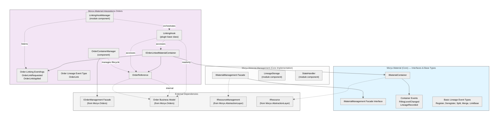
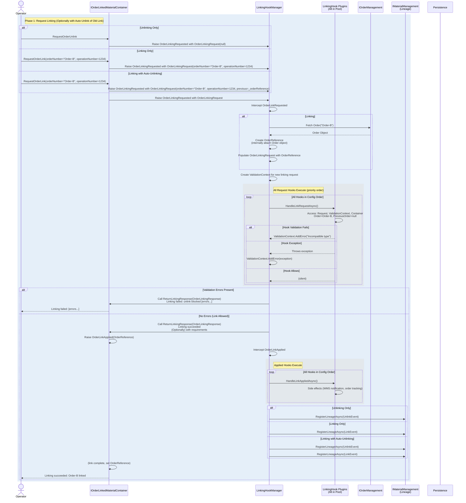

# Material Management Module Architecture

## Overview

The Material Management system is organized in **layered packages** with clear separation between core material operations and domain-specific integrations. Each layer adds functionality without polluting the core abstraction.


```mermaid
%%{init: { 'theme': 'neutral', "flowchart": { "nodeSpacing ": 8, "diagramPadding": 48, "wrappingWidth": 300, "rankSpacing": 24, "padding": 8 }, "themeVariables": { "fontSize": "11px" } }}%%
graph TB

    subgraph External["External Dependencies"]
        IOrderMgmt["IOrderManagement Facade<br/>(from Moryx.Orders)"]
        Order["Order Business Model<br/>(from Moryx.Orders)"]
        ResourceMgmt["IResourceManagement<br/>(from Moryx.AbstractionLayer)"]
        IResource["IResource<br/>(from Moryx.AbstractionLayer)"]
    end

    subgraph Core["Moryx.Material (Core) — Interfaces & Base Types"]
        IMC["IMaterialContainer"]
        MgmtFacadeInterface["IMaterialManagement Facade Interface"]
        Events["Container Events<br/>FillingLevelChanged<br/>LineageRecorded"]
        LineageTypes["Basic Lineage Event Types<br/>Register, Deregister, Split, Merge, LinkBase"]

        IMC --> Events
    end

    subgraph Management["Moryx.Material.Management (Core Implementation)"]
        MgmtFacade["IMaterialManagement Facade"]
        LineageStorage["LineageStorage<br/>(module component)"]
        StateHandler["StateHandler<br/>(module component)"]

        MgmtFacade --> MgmtFacadeInterface
    end

    subgraph OrderIntegration["Moryx.Material.Integrations.Orders"]
        IOMC["IOrderLinkedMaterialContainer"]
        LinkingHookMgr["LinkingHookManager<br/>(module component)"]
        HookBase["LinkingHook<br/>(plugin base class)"]
        OrderContainerMgr["OrderContainerManager<br/>(component)"]
        OrderEvents["Order-Linking EventArgs<br/>OrderLinkRequested<br/>OrderLinkApplied"]
        OrderLineageType["Order Lineage Event Type<br/>OrderLink"]
        OrderRef["OrderReference"]

        IOMC --> OrderRef
        IOMC --> IMC
        IOMC --> OrderEvents
        LinkingHookMgr -.listens.-> OrderEvents
        LinkingHookMgr -.orchestrates.-> HookBase
        HookBase -.accesses.-> OrderRef
        HookBase -.accesses.-> IOMC
        HookBase -.readonly.-> Order
        OrderContainerMgr --> IOrderMgmt
        OrderContainerMgr -.manages lifecycle.-> OrderRef
        OrderRef -.internal.-> Order
    end

    OrderRef -.-> Order
    IMC -.-> IResource
    MgmtFacade -.-> ResourceMgmt

    style Core fill:#e1f5ff
    style OrderIntegration fill:#f3e5f5
    style External fill:#f5f5f5
```

---

## Layer 1: Material Management

### Base package with public APIs (`Moryx.Material`)

#### `IMaterialContainer : IResource`

**Inheritance:**

- Extends `IResource` (Id, Name, Capabilities)

**Properties:**

- `string Material` — Reference to the container's content (enriched in subclasses if linked to product type/instances)
- `decimal Quantity` — Current filling level/material amount
- `MaterialContainerStateBase State` — Details in [below](#states)

**Events:**

- `event EventHandler<MaterialChangedEventArgs> MaterialChanged`
- `event EventHandler<FillingLevelChangedEventArgs> FillingLevelChanged`
- `event EventHandler<StateChangedEventArgs> StateChanged`

**Purpose:**
Provides a unified abstraction for any container holding material. Can be extended by domain-specific integrations without modifying the core.

---

#### `IMaterialManagement` Facade

**Operations:**

- Container lifecycle (Create, Delete, Get)
- [Lineage events](#data-flow-complete-re-link-sequence-with-hooks--lineage) (Register, Split, Merge, Link, ...)
- [Material flow interactions](#material-flow-features-requests-announcements-pre-advice) (Request, Announce, Pre-Advice)

**Events:**

- Container registration, deletion, state changes, lineage events

**Purpose:**
Central coordination point for all material management operations and external integration (WMS, ERP sync).

---

#### `LinkingHook` (Plugin Base Class)

```csharp
public abstract class LinkingHook
{
    /// <summary>
    /// Called before link is applied. Populate ValidationContext to block or allow.
    /// All hooks are executed; errors accumulated in context.
    /// ValidationContext available as protected property.
    /// </summary>
    protected virtual async Task HandleLinkRequestAsync(CancellationToken ct)
    {
        // Default: no-op (allow)
        // To block: ValidationContext.AddError("reason");
    }

    /// <summary>
    /// Called after container confirms link via second event.
    /// Perform side effects (WMS notification, tracking, etc.)
    /// </summary>
    protected virtual async Task HandleLinkAppliedAsync(CancellationToken ct)
    {
        // Default: no-op
    }
}
```

**Protected/Internal Properties:**

- `LinkingRequest Request { get; internal set; }` — Current linking request (order#, op#)
- `ValidationContext ValidationContext { get; internal set; }` — Shared error/warning/info accumulator (append-only)
- `IMaterialContainer Container { get; internal set; }` — Container resource raising event

**Hook Lifecycle (Config-Based Plugin Factory):**

- Transient plugins created per request via DI plugin factory (MORYX standard)
- Registered in module configuration; execution order defined per config
- All hooks execute; validation context accumulates errors
- If context has errors after first phase, linking is rejected with collected reasons
- If validation passes, hooks execute again in applied phase for side effects

**Implementations (Examples):**

- `ValidationHook` — Checks if container type is compatible with domain objects, e.g. product type
- `AcknowledgmentHook` — Requires operator confirmation in critical zones
- `TrackingHook` — Publishes to WMS/ERP, e.g. for order-material linkage notification

**Purpose:**
Pluggable validation, side-effect, and integration logic: Each hook can independently determine if linking proceeds.
An example including the whole data-flow is depicted in the [order integration section](#data-flow-complete-re-link-sequence-with-hooks--lineage).

#### `Reference` (Wrapper base class for domain object references)

Defines baseline state handling of domain reference wrappers. A detailed example is outlined for the [OrderReference](#orderreference).

**State Machine:**

```text
[Initialized] → [Active] → [Inactive]
             ↘            ↗
             [Unavailable]
```

- **Initialized**: Reference information available; business object not yet resolved
- **Active**: Business object is set internally and its data is accessible; properties are mapped to public getters
- **Inactive**: Business object deliberately removed (e.g., during integration shutdown); reference remains valid
- **Unavailable**: Lookup for business object failed; reference should be discarded or re-attempted

**Properties:**

- `ReferenceState State { get; protected set; }` — Current reference state

**Behavior:**

- Created and owned by the integration (not the resource itself)
- Properties are **mapped** from the business object in the Active state.
- State transitions managed by integration based on system/integration events
- If the referenced business object is removed/unavailable, transitions to Unavailable; container can be unlinkable
- No direct public access to business objects from the resource level — all access is through Reference subclasses.

**Purpose:**
Facade-owned intermediate that abstracts away direct business object dependency, tracks resolution state, and supports clean lifecycle management (shutdown, order deletion).

#### `LinkingRequirement` and Hook Requirements Protocol

**Base Type:**

```csharp
/// <summary>
/// Base interface for requirements imposed by hooks during linking validation.
/// Can be automatic (system-handled) or manual (operator-handled).
/// Subclasses define specific requirement semantics.
/// </summary>
public interface ILinkingRequirement
{
    /// <summary>
    /// Whether this requirement is automatic (system default) or manual (operator input required)
    /// </summary>
    RequirementMode Mode { get; }

    /// <summary>
    /// Whether this requirement was fulfilled/handled
    /// </summary>
    bool IsFulfilled { get; set; }
}

public enum RequirementMode
{
    /// <summary>System can apply default fulfillment</summary>
    Automatic = 0,

    /// <summary>Operator must explicitly fulfill</summary>
    Manual = 1
}
```

**Example Subclass:**

```csharp
/// <summary>
/// Requires operator acknowledgment for a linking action.
/// Can be serialized/deserialized via EntrySerialize attributes for UI display.
/// </summary>
[DataContract]
public class OperatorAcknowledgementRequirement : ILinkingRequirement
{
    public RequirementMode Mode => RequirementMode.Manual;

    /// <summary>
    /// The acknowledgment text/code operator must enter
    /// </summary>
    [EntrySerialize]
    [Display(Name = "Operator", Description = "Register operator pseudonym to confirm action.")]
    // [PossibleOperators]  // ToDo: Add attribute to operators package
    public string? OperatorPseudonym { get; set; }

    public bool IsFulfilled
    {
        get => !string.IsNullOrEmpty(AcknowledgmentText);
        set { }
    }
}
```

**Lifecycle in Two-Phase Linking:**

```text
Phase 1: Validation Request
┌─────────────────────────────────────────────────┐
│ Manager executes all hooks (HandleLinkRequestAsync)
│ Each hook can APPEND requirements to ValidationContext
│ (Aside from the ContextInformation, ContextWarning, ContextError)
│ Requirements are append-only; no removal or modification
│ Result: ValidationContext contains array of Requirements
└─────────────────────────────────────────────────┘
         ↓
┌─────────────────────────────────────────────────┐
│ Manager calls FIRST callback on Container:
│ ReturnLinkingResponse {
│   ValidationContext (with Requirements),
│   Reference
│ }
└─────────────────────────────────────────────────┘
         ↓
┌─────────────────────────────────────────────────┐
│ CONTAINER PHASE: Display and Fulfill
│ 1. Container (or handling Cell) receives callback
│ 2. Extract Requirements from ValidationContext
│ 3. Display to operator (serializable via EntrySerialize)
│ 4. Collect operator input → fulfill requirements
│ 5. Retries possible if validation fails
│ 6. If the requirement is fulfilled, apply the Reference to the respective Container property.
│ 7. Fire SECOND event: LinkAppliedEventArgs
└─────────────────────────────────────────────────┘
         ↓
Phase 2: Applied
┌─────────────────────────────────────────────────┐
│ Manager receives LinkAppliedEventArgs:
│ {
│   Reference (assigned),
│   ValidationContext (with Requirements),
│ }
│
│ Manager executes all hooks (HandleLinkAppliedAsync)
│ Hooks verify requirement fulfillment (or non-fulfillment)
│ Result: Hooks provide side effects (WMS notify, etc.)
└─────────────────────────────────────────────────┘
         ↓
┌─────────────────────────────────────────────────┐
│ Success: Register LinkEvent lineage
│ OR
│ Failure: Register LinkErrorEvent lineage
│ (if requirements not met)
└─────────────────────────────────────────────────┘
```

**Key Design Principles:**

1. **Append-Only Requirements**: Hooks cannot remove; only add new requirements
2. **Container Ownership**: Container (or handling Cell) orchestrates fulfillment UI/logic
3. **Serializable Requirements**: Use MORYX EntrySerialize pattern for UI integration
4. **Validation Attributes**: Requirements can have validation rules; deserialized properties are auto-validated
5. **Read-Only Context**: ValidationContext entries are frozen after phase 1; Requirements can mutate if allowed
6. **Error Recording**: Failed linking attempts are recorded as lineage error events for audit trail

### Module package (`Moryx.Material.Management`)

#### ContainerStateHandler (Module component)

**Overview:**
Instead of separate entities for material requests, incoming announcements, and pre-advice, the `IMaterialContainer` itself progresses through a **state machine** that tracks the container's lifecycle from request through deregistration.

##### Container State Machine

###### States

States are represented by the MaterialContainerState class, which comes with five subclasses

- **Requested**: Material request created; container may not yet exist in the system.
- **Inbound**: Incoming announcement received; container en route or awaiting registration

> If no specific material container is requested or announced, a "virtual" container instance is created. The container instance is used when registering the related material later on (possibly through split operations on the virtual container feeding into the actually registered containers)

- **Available**: Container registered and in use (e.g., linked to order, being consumed)
- **Outbound**: Pre-advice created; container ready for pickup/departure
- **Deregistered**: Container removed from the system

###### State Transitions

- State transitions are requested on the `IMaterialManagement` facade or directly applied to the resource.
- In any case, the `StateHandling` component in the material management module registers lineage events and raises the corresponding events.
- If a state transition is caused by a facade call, it also takes care of applying the state transition on the resource.

```text
    Optional: Skip Requested
     ───────────────────┐
                        │
                        ▼
    [Requested] ──→ [Inbound] ──→ [Available] ──→ [Outbound]    [Deregistered]
         │                          ▲                                 ▲
         │                          │                                 │
         └──────────────────────────┘                                 │
            Optional: Skip Inbound  │                                 │
     ───────────────────────────────┘                                 │
    Optional: Skip Requested & Inbound                                │
                                                                      │
         └───────────────└─────────────└───────────────└──────────────┘
                            Transition to Derigistered
```

**Shortcuts allowed:**

- Container can skip Requested (announced without prior request)
- Container can skip Inbound after Requested (registered directly without announcement after request)
- Container can skip Requested & Inbound (registered directly without announcement or request)
- Container can transition to Deregistered from anywhere (cancel request/announcement, deregistered without pre-advice)

**State Transition Events:**
Each transition fires an event (via IMaterialManagement facade):

- `event EventHandler<MaterialRequestedEventArgs> MaterialRequested`
- `event EventHandler<MaterialInboundEventArgs> MaterialInbound`
- `event EventHandler<ContainerAvailableEventArgs> ContainerAvailable`
- `event EventHandler<OutboundEventArgs> MaterialOutbound`
- `event EventHandler<ContainerDeregisteredEventArgs> ContainerDeregistered`

###### Material Request

**State Definition:**

```csharp
public class RequestedState : MaterialContainerStateBase {
    public Guid? Guid { get; private set; } // Optional identifier of the underlying request
    public DateTime? ExpectedArrival { get; private set; }  // Optional due date of the request
    public bool IsPartiallyFulfilled { get; set; } // Indicates whether material (containers) related to the request were announced/registered already
}
```

**Facade business model:**

```csharp
public class MaterialRequest
{
    public Guid? Guid { get; private set; }
    public string Material { get; private set; }
    public DateTime CreatedAt { get; private set; }
    public decimal RequestedQuantity { get; private set; }
    public IIdentifiableObject? ContainerId { get; private set; } // If specific containers are requested
    public DateTime? ExpectedArrival { get; private set; }  // Optional
}
```

**Facade Operations**

- `Task<IMaterialContainer> RequestMaterialAsync(MaterialRequest request, CancellationToken ct)`
  - Fires `MaterialRequested` event
  - Returns the created Resource instance of the "virtual" material container holding the requested material

Possible extension methods:

- `Task<IReadOnlyList<IMaterialContainer>> GetPendingMaterialRequestsAsync(CancellationToken ct)`
- `Task CancelMaterialRequestAsync(Guid requestId, CancellationToken ct)`

###### Material Inbound

**State Definition:**

```csharp
public class InboundState : MaterialContainerStateBase {
    public Guid? Guid { get; private set; } // Optional identifier of the material inbound
    public DateTime? ExpectedArrival { get; private set; }  // Optional due date of the request
    public bool IsPartiallyFullfilled { get; set; } // Indicates whether inbound material (containers) related to the announcement were registered already
    public Guid? RequestReference { get; set; }  // Optional (cross-reference) to an existing MaterialRequest
}
```

**Facade business model:**

```csharp
public class MaterialAnnouncement
{
    public Guid? Guid { get; private set; }
    public Guid? RequestReference { get; set; }  // Optional (cross-reference) to an existing MaterialRequest
    public string? Material { get; private set; } // Can be omitted, if a request is referenced
    public DateTime CreatedAt { get; private set; }
    public decimal AnnouncedQuantity { get; private set; }
    public IIdentifiableObject? ContainerId { get; private set; } // If specific containers are requested
    public DateTime? ExpectedArrival { get; private set; }  // Optional
}
```

**Facade Operations:**

- `Task<IMaterialContainer> AnnounceMaterialAsync(MaterialAnnouncement announcement, CancellationToken ct)`
  - Fires `MaterialInbound` event
  - Returns the created/updated Resource instance of the "virtual" material container holding the requested material

Possible extension methods:

- `Task<IReadOnlyList<IMaterialContainer>> GetActiveMaterialAnnouncementsAsync(CancellationToken ct)`
- `Task DropMaterialAnnouncementAsync(Guid requestId, CancellationToken ct)`

###### Material Outbound

**State Definition:**

```csharp
public class OutboundState : MaterialContainerStateBase {
    public PreAdviceDepartureReason DepartureReason { get; set; }
}

public enum PreAdviceDepartureReason
{
    FinishedGoods = 0,
    UnusedMaterial = 1,
    Transfer = 2,
    Scrap = 3,
    Other = 4
}
```

**Facade business model:**

```csharp
public class MaterialPreAdvice
{
    public IMaterialContainer Container { get; private set; }
    public PreAdviceDepartureReason DepartureReason { get; set; }
}
```

**Facade Operations:**

- `Task<IMaterialContainer> PreAdviceMaterialAsync(MaterialPreAdvice preAdvice, CancellationToken ct)`
  - Fires `MaterialOutbound` event
  - Returns the updated Resource instance

Possible extension methods:

- `Task<IReadOnlyList<IMaterialContainer>> GetActiveMaterialPreAdvicesAsync(CancellationToken ct)`

###### Request/Announcement Fullfilment Algorithm

**Automatic Fulfillment:**

When material is announced or a material container is registered through the `IMaterialManagement` or `IResourceManagement` facade the module automatically:

1. Searches for matching containers in `Requested` or `Inbound` state (by container identity and/or guid)
2. Switch:
  a. Guid - Match; Requested Container Identifier - Empty; Amount <= Quantity
    -> Sets container identity
    -> Updates Quantity
    -> Transitions to next state (Inbound or Active)
  b. Guid - Match; Requetsed Container Identifier - Empty; Amount > Quantity
    -> creates new container resource with identifier and quantity
    -> reduces amount on found container
    -> sets partially recieved flag on found container
  c. Container Identifier - Match; Amount <= Quantity
    -> Updates Quantity
    -> Transitions to next state (Inbound or Active)
3. Fires `StateChanged` event
4. Persists lineage event

**Manual Fulfillment:**

- Operator can select a pending request/announcement in the UI, then register matching containers
- Operator can manually drop announcements (e.g., "item no longer arriving")

#### LineageEventStorage (Module component)

**Scope & Coverage:**

- Persist **all linking attempts** (successful and failed) for a complete audit trail
- Capture on both happy path and error paths

**What Gets Persisted:**

ResourceStubs:

- Ensure removed containers can still be found in the lineage trail
- Allow linking of active containers via id or identifier

Lineage Events:

- What event happened (i.e., type + custom type data)?

From ValidationContext:

- Error entries (type, hook source, text, timestamp)
- Warning entries (type, hook source, text, timestamp)
- Hook identification (fully qualified type name)
- Linking Requirement's object state (type, isFulfilled, DataMember-attributed properties)

**Database Schema Structure:**

```text
ContainerStub
├─ Id (int, PK)
├─ ResourceId (long)
├─ ResourceType (string)
└─ ResourceIdentifier (string, nullable)

LineageEvent
├─ Id (guid, PK)
├─ ContainerStubId (FK)
├─ EventType (fully qualified type name, e.g. for Registration, Deregistration, Split, Merge, ...)
├─ Timestamp (datetime)
└─ EventDataJson (nvarchar(max), serialized event details)

ValidationContextEntry
├─ Id (guid, PK)
├─ LineageEventId (FK)
├─ EntryType (enum: Info, Warning, Error)
├─ HookType (string, fully qualified)
└─ EntryText (nvarchar(max))

LinkingRequirement
├─ Id (guid, PK)
├─ LineageEventId (FK)
├─ RequirementType (string, fully qualified)
├─ IsFulfilled (bit)
├─ TypeIndexColumn (string, indexed for query)
└─ DataMemberPropertiesJson (nvarchar(max))
```

**Key Design Principles:**

1. **Separate Persistence**: ValidationContext entries are linked to LineageEvent via FK (not embedded in event)
2. **Indexed Queryability**: Requirement type + isFulfilled columns are indexed for troubleshooting
3. **Hybrid Storage**: Requirement objects are stored as (indexed columns + JSON blob) for a balance of structure and flexibility
4. **No Retry Versioning**: Retries by container (local to Cell) are not logged; only new sequences after failure create new lineage events
5. **Audit Trail**: Full history of validation attempts, decisions, and requirements per container
6. **Hook Tracing**: Fully qualified hook type identifies which plugin raised each context entry

### Module Design Decisions

| Decision | Resolution |
| -------- | ---------- |
| **Container State Ownership** | State owned by Resource; Transitioning method available to module; Event forwarding & lineage event processing triggered through resource events |

**Open Design Question:**

- How to enforce proposed container state transitions while keeping state serializable?\
**Risk**: Serialization compliance (ensuring state is only modified via protocol, not manually set).

---

## Layer 2: Module Integrations

Integrations work based on custom *container interfaces*, *links*, *hook base types* and *lineage events*

### Order Integration Module (`Moryx.Material.Integration.Orders`)

#### `IOrderLinkedMaterialContainer : IMaterialContainer`

**Inheritance:**

- Extends `IMaterialContainer`

**New Properties:**

- `OrderReference? LinkedOrder` — Reference to linked order (can be null)

**Events:**

- `event EventHandler<OrderLinkRequestEventArgs> OrderLinkRequested`
  - EventArgs contains `OrderLinkingRequest` with:
    - Order number
    - Operation number (optional)
  - Fired when user/automation initiates a link attempt

- `event EventHandler<OrderLinkAppliedEventArgs> OrderLinkApplied`
  - EventArgs contains applied OrderReference
  - Fired after linking is validated and accepted

**Purpose:**
Extends IMaterialContainer with order-specific linking semantics. Containers can now declare that they are order-capable without requiring the order object directly.

---

#### `OrderReference`

Specific reference implementation based on [Reference base class](#reference-wrapper-base-class-for-domain-object-references).

**Visibility:** Property within `IOrderLinkedMaterialContainer`

**State Machine:**

- **Initialized**: Order information (order#, op#) available; order not yet resolved
- **Active**: Order is set internall; properties mapped to public getters
- **Inactive**: Order deliberately removed (e.g., during integration shutdown); reference remains valid
- **Unavailable**: Order lookup failed (order doesn't exist in system); reference should be discarded or re-attempted

**Additional Properties:**

- `(internal) Order _order` — Reference to actual Order business object from IOrderManagement
- `string OrderNumber { get; }` — Order number (always available)
- `string? OperationNumber { get; }` — Operation number (cached; may be null)
- `string? Status { get; }` — Mirrored from Order (mapped from current business object state)
- Other mapped properties as needed (TBD: remaining quantity, dates, etc.)

#### `OrderContainerManager` (Module Component)

**Responsibilities:**

- Manages lifecycle of `IOrderLinkedMaterialContainer` instances on integration startup/shutdown
- Handles order-container recovery from persistence on system restart
- Cascades unlinking when containers are deleted
- Subscribes to container deletion events and ensures clean deregistration

**Lifecycle:**

- Initialized during module start (after IOrderManagement dependency is ready)
- Loads all persisted OrderReferences; transitions from Initialized → Active or Unavailable
- Listens for container lifecycle events (registration, deletion)
- On container deletion: auto-unlink via lineage event
- Cleaned up during module stop (transitions all OrderReferences to Inactive)

**Purpose:**
Ensures consistency and clean lifecycle management across system restarts and container deletion.

#### `LinkingHookManager` (Module Component)

**Responsibilities:**

- Subscribes to all `IOrderLinkedMaterialContainer` events
- Listens for `OrderLinkRequested` and `OrderLinkApplied` events
- On event, populates `OrderLinkingRequest` with:
  - Order details (from IOrderManagement via OrderReference)
  - Validation context (TBD)
- Routes populated request to all registered `LinkingHook` plugins

**Lifecycle:**

- Initialized during module start
- Maintains registry of active hooks (via plugin discovery)
- Executes hooks in priority order

**Purpose:**
Acts as event orchestrator — decouples container events from hook logic.

---

#### `OrderLinkingHook` (Plugin Base Class)

**Virtual Methods:**

```csharp
public abstract class OrderLinkingHook : LinkingHook
{
    ...
}
```

**Additional Protected/Internal Properties:**

- `Order Order { get; internal set; }` — Current Order business object (from IOrderManagement)
- `Order? PreviousOrder { get; internal set; }` — Previous Order if re-linking; null on first link

`Request` is populated with `OrderLinkingRequest` and `Container` holds an `IOrderLinkedMaterialContainer`.

#### Data Flow: Complete Re-Link Sequence with Hooks & Lineage

**Scenario:** Container already linked to Order-A; operator requests link to Order-B


```mermaid
sequenceDiagram
    actor Operator
    participant Container as IOrderLinkedMaterialContainer
    participant Manager as LinkingHookManager
    participant Hook as LinkingHook Plugins<br/>(All in Pool)
    participant OrderMgmt as IOrderManagement
    participant Facade as IMaterialManagement<br/>(Lineage)
    participant DB as Persistence

    rect rgba(0, 100, 200, 0.1)
        note right of Operator: Phase 1: Request Linking (Optionally with Auto-Unlink of Old Link)

        alt Unlinking Only
            Operator->>Container: RequestOrderUnlink
            Container->>Manager: Raise OrderLinkingRequested with OrderLinkingRequest(null)
        else Linking Only
            Operator->>Container: RequestOrderLink(orderNumber="Order-B", operationNumber=1234)
            Container->>Manager: Raise OrderLinkingRequested with OrderLinkingRequest(orderNumber="Order-B", operationNumber=1234)
        else Linking with Auto-Unlinking
            Operator->>Container: RequestOrderLink(orderNumber="Order-B", operationNumber=1234)
            Container->>Manager: Raise OrderLinkingRequested with OrderLinkingRequest(orderNumber="Order-B", operationNumber=1234, previous=_orderReference)
        end

        Container->>Manager: Raise OrderLinkingRequested with OrderLinkingRequest
        Manager->>Manager: Intercept OrderLinkRequested

        alt Linking
            Manager->>OrderMgmt: Fetch Order("Order-B")
            OrderMgmt-->>Manager: Order Object
            Manager->>Manager: Create OrderReference<br/>(internally attach Order object)
            Manager->>Manager: Populate OrderLinkingRequest with OrderReference
        end

        Manager->>Manager: Create ValidationContext for new linking request

        rect rgba(200, 100, 0, 0.05)
            note right of Manager: All Request Hooks Execute (priority order)
            loop All Hooks in Config Order
                Manager->>Hook: HandleLinkRequestAsync()
                Hook->>Hook: Access: Request, ValidationContext, Container<br/>Order=Order-B, PreviousOrder=null
                alt Hook Validation Fails
                    Hook-->>Manager: ValidationContext.AddError("Incompatible type")
                else Hook Exception
                    Hook-->>Manager: Throws exception
                    Manager->>Manager: ValidationContext.AddError(exception)
                else Hook Allows
                    Hook-->>Manager: (silent)
                end
            end
        end

        alt Validation Errors Present
            Manager->>Container: Call ReturnLinkingResponse(OrderLinkingResponse)<br>Linking failed: unlink blocked [errors...]
            Container-->>Operator: Linking failed: [errors...]
        else No Errors (Link Allowed)
            Manager->>Container: Call ReturnLinkingResponse(OrderLinkingResponse)<br>Linking succeeded<br>(Optionally) with requirements
            Container->>Container: Raise OrderLinkApplied(OrderReference)
            Manager->>Manager: Intercept OrderLinkApplied

            rect rgba(200, 100, 0, 0.05)
                note right of Manager: Applied Hooks Execute
                loop All Hooks in Config Order
                    Manager->>Hook: HandleLinkAppliedAsync()
                    Hook->>Hook: Side effects (WMS notification, order tracking)
                end
            end

            alt Unlinking Only
                Manager->>Facade: RegisterLineageAsync(UnlinkEvent)
            else Linking Only
                Manager->>Facade: RegisterLineageAsync(LinkEvent)
            else Linking with Auto-Unlinking
                Manager->>Facade: RegisterLineageAsync(UnlinkEvent)
                Manager->>Facade: RegisterLineageAsync(LinkEvent)
            end

            Container->>Container: (link complete, set OrderReference)
            Container-->>Operator: Linking succeeded: Order-B linked
        end
    end
```

---

#### Design Principles Applied

| Principle | Implementation |
| --------- | -------------- |
| **Abstraction** | IMaterialContainer is order-agnostic; order linking is integration concern |
| **Inversion of Control** | Hooks plugged via module discovery; no hardcoded linking logic |
| **Facade Ownership** | OrderReference owned by integration facade, not the resource |
| **Event-Driven** | Linking initiated by events, not direct method calls |
| **Separation of Concerns** | Core material ops ≠ order-specific ops ≠ validation rules |
| **Extensibility** | New hook types added without modifying container or manager |
| **Two-Phase Linking** | Validation phase (hooks) → Container callback with OrderReference → Applied phase (side effects) |

---

#### Order Integration Design Decisions

| Decision | Resolution |
| -------- | ---------- |
| **OrderReference Serialization** | Can be persisted/deserialized on Resource; populating the refernece happens in [OrderContainerManager](#ordercontainermanager-module-component) |

---

## Architecture Decision Record

| Decision | Resolution |
| -------- | ---------- |
| **Linking Semantics** | Depends on container implementation; e.g. Exclusive — one container can be linked to only one order; re-linking auto-unlinking first |
| **Hook Blocking** | Context mutation — hooks populate a shared `ValidationContext` with errors/warnings/info; manager checks after all hooks complete |
| **Plugin Discovery** | Config-based plugin factory (MORYX DI standard); transient creation per request; execution order defined in config |
| **Link Persistence** | Denormalized on container — e.g. `OrderReference` property only; no separate Link entity |
| **Reference Sync** | State machine-based (Initialized → Active → Inactive/Unavailable); lazy resolution; properties mapped from business object |
| **Two-Phase Linking** | Phase 1: Hooks validate via HandleLinkRequestAsync (populate ValidationContext) → Phase 2: Container callback with Reference → Phase 3: Hooks execute side effects via HandleLinkAppliedAsync |
| **Re-link Flow** | Auto-unlink (with link hooks) → re-link (with link hooks) → register unlink lineage → register link lineage; atomicity ensured by transaction scope |
| **Unlink Hooks** | Yes — unlinking triggers full hook cycle (both phases) for validation and side effects |
| **Material Flow Facade Scope** | Linking is resource-only (not in IMaterialManagement); facade handles lineage events, requests, announcements, pre-advice, deregistration |
| **Lineage Events** | Typed events (registration, deregistration, link-create, link-remove, split, merge, operator-change); share base interface; serializable; resources converted to ResourceStubs for persistence |
| **Acknowledgment** | Separate AcknowledgmentHook plugin extending LinkingHook; validates via ValidationContext |
| **Hook Exception Handling** | Hooks can throw; manager catches and adds to ValidationContext; execution continues with other hooks |
| **ValidationContext** | Errors + Warnings + Info (append-only); can carry Hook requirements; in-memory during orchestration, optionally persisted to audit trail |

## Remaining Design Details for Deep Dive

### 1. OrderReference Serialization Guarantee

- **Issue**: Ensure OrderReference cannot be "correctly" set without following the event-driven protocol, even after persistence/deserialization
- **Approaches**:
  - Add state that marks OrderReference as "sealed" (read-only after deserialization)?
  - Use private setters + factory methods to enforce protocol?
  - Validate state machine transitions on deserialization?
- **Question**: Can/Should we guarantee event-driven protocol compliance while allowing persistence within resource?

### 2. Lineage Event Serialization & ResourceStub

- Deserialization when resource is deleted (placeholder creation behavior)
- Serialization of custom lineage event data

### 3. Container Event Processing Awareness

How can a container reliably know whether the integration (LinkingHookManager, OrderContainerManager) is currently capable of processing its events?

**Context:**

- On system startup, containers may exist in persistence before the integration module is fully initialized
- During runtime, should a container raise an event if no listeners are present?
- This prevents "lost" events and ensures deterministic behavior

**Possible Approaches:**

- Integration registers a capability/feature with container on init; container checks before raising events

### 4. Should we provide a MaterialContainer base class?

### 5. Should container request/announcement/register via facade include linking within a single method call?

- Linking is usually a two step process, involving the container. How should this happen if the container is just created?
- How can a fluent UX be achieved if in the background information is handled in a two step process

#### 6. How can requirements for linking be handled from within in the Material Management UI?

- Requeirements are given to the resource and can be handled forwarded from there
- How could they land in the Material Management UI for processing? Or shouldn't they afterall?

#### 7. Should multiple material requests/announcements be combined if possible?

- What happens if the same material is requested twice? Added/Combined, or kept seperate?
- Same question for announcements?
- What happens if the same container is requested twice?
