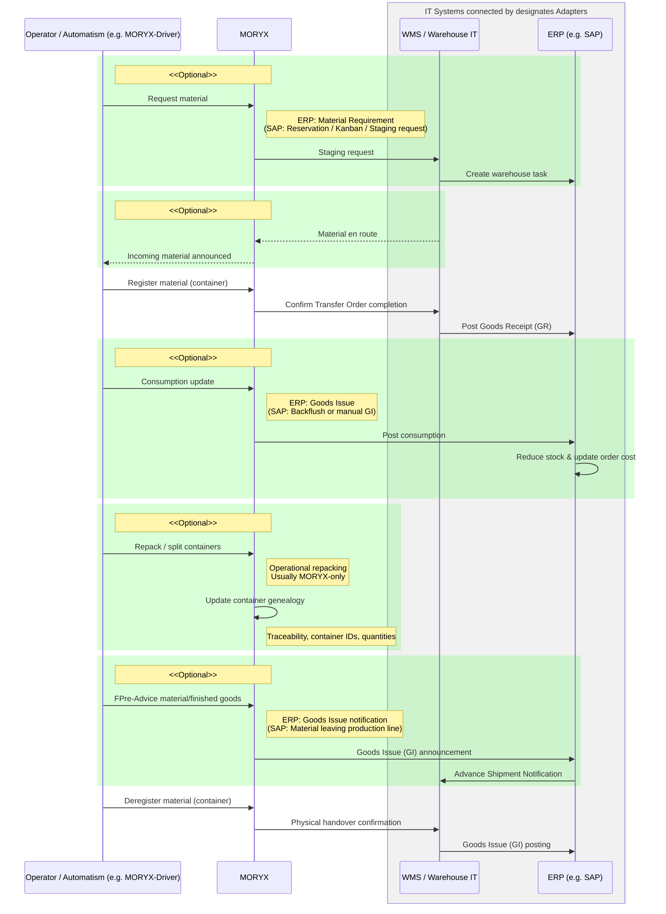

# Flow of Material (Containers) in MORYX

## External Perspective

```mermaid
sequenceDiagram
    participant Operator as Operator / Automatism (e.g. MORYX-Driver)
    participant MORYX as MORYX
    box rgba(255,255,255,0.25) IT Systems connected by designates Adapters
        participant WMS as WMS / Warehouse IT
        participant ERP as ERP (e.g. SAP)
    end

    %% 1. Material request (optional)
    rect rgba(0, 255, 0, 0.15)
        note right of Operator: <<Optional>>
        Operator->>MORYX: Request material
        note right of MORYX: ERP: Material Requirement<br/>(SAP: Reservation / Kanban / Staging request)

        MORYX->>WMS: Staging request
        WMS->>ERP: Create warehouse task
    end

    %% 2. Incoming material announcement (optional)
    rect rgba(0, 255, 0, 0.15)
        note right of Operator: <<Optional>>
        WMS-->>MORYX: Material en route
        MORYX-->>Operator: Incoming material announced
    end

    %% 3. Material registration at machine
    Operator->>MORYX: Register material (container)
    MORYX->>WMS: Confirm Transfer Order completion
    WMS->>ERP: Post Goods Receipt (GR)

    %% 4a. Material consumption (optional)
    rect rgba(0, 255, 0, 0.15)
        note right of Operator: <<Optional>>
        Operator->>MORYX: Consumption update
        note right of MORYX: ERP: Goods Issue<br/>(SAP: Backflush or manual GI)

        MORYX->>ERP: Post consumption
        ERP->>ERP: Reduce stock & update order cost
    end

    %% 4b. Operational repacking (optional, parallel)
    rect rgba(0, 255, 0, 0.15)
        note right of Operator: <<Optional>>
        Operator->>MORYX: Repack / split containers
        note right of MORYX: Operational repacking<br/>Usually MORYX-only

        MORYX->>MORYX: Update container genealogy
        note right of MORYX: Traceability, container IDs, quantities
    end

    %% 5. Finished goods advice (optional)
    rect rgba(0, 255, 0, 0.15)
        note right of Operator: <<Optional>>
        Operator->>MORYX: FPre-Advice material/finished goods
        note right of MORYX: ERP: Goods Issue notification<br/>(SAP: Material leaving production line)

        MORYX->>ERP: Goods Issue (GI) announcement
        ERP->>WMS: Advance Shipment Notification
    end

    %% 6. Deregister finished goods at machine
    Operator->>MORYX: Deregister material (container)
    MORYX->>WMS: Physical handover confirmation
    WMS->>ERP: Goods Issue (GI) posting
```
