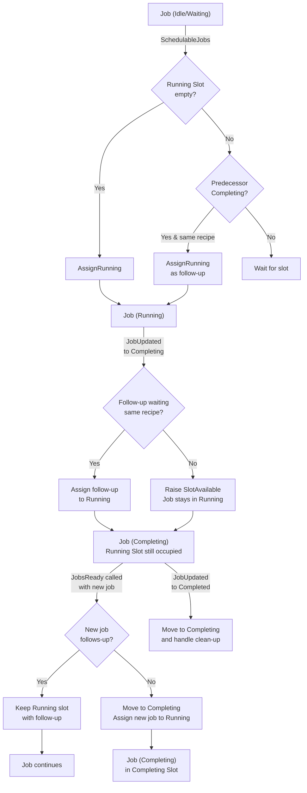

# ProcessEngine

The Process Engine is a server module hosting some of the control system's major components groups:

- [Job Management](./job-management.md)
- [Process Controller](./process-controller.md)

Its mission is to provide these components with a common life cycle and to export public APIs to be used by other components.
In addition it imports all global components which are needed.

## Provided Facades

The Process Engine exports facades and forwards external requests to the internal components.

- [IJobManagement](xref:Moryx.ControlSystem.Jobs.IJobManagement)
- [IProcessControl](xref:Moryx.ControlSystem.Processes.IProcessControl)

## Dependencies

The Process Engine depends on the following APIs and data-models. Detailed documentation can be found by clicking the dependencies link.

## Referenced Facades

|Plugin API | Start dependency | Optional | Usage |
|-----------|------------------|----------|------ |
| IRecipeProvider | Yes | Yes | Each Job references a recipe by its provider and its ID. |
| IProductManagement | Yes | No | The ProductManagement is used to create the Article data for each article produced by a production process. |
| IResourceManagement | Yes | No | The ResourceManagement is used the get the resources needed to execute an activity. |

## Data Models

- [Moryx.ControlSystem.ProcessEngine.Model](xref:Moryx.ControlSystem.ProcessEngine.Model)

## Architecture

As described above, one of the Process Engines major task is to forward request from the outside to the embedded plugins. 
This is reflected by the module's architecture. The module provides the facades to the outside and holds the plugins.


## Scheduling

When describing the behavior of schedulers as well as comparing them, the concept of scheduling slots is important. A slot holds a group of adjacent jobs of the same recipe enclosed in its pre- and post production setups. Jobs that currently occupy a slot are executed, while others wait for a slot. 

### ParallelScheduler
The parallel scheduler allows for a certain number of jobs to dispatch processes in parallel. It will start by executing the initial setup, then the production jobs and any follow-up jobs it might have. If the last job of that recipe is completed the clean-up will be executed. After completion of the Clean-Up the slot is released and can be assigned to the next group of jobs and their setups. Job groups that currently hold a slot can be increased with follow-up jobs anytime until the post production setup is completed.

Setting the number of slots to **1** results in job scheduling without overlap, where the machine is cleared after every group of jobs, before a new one is started. Any value greater than **1** gives true parallel execution. Jobs that currently hold a slot can be increased until the post production setup is started.

This scheduler is intended for single job execution or larger machines with true parallel production, compared to mixed production caused by seamless scheduling explained below.

### SeamlessScheduler

The seamless scheduler is intended for assembly lines that should not be cleared between different orders, but only have a **single running job** (inserting parts) while an unlimited number of jobs might still be completing within the machine. The scheduler maintains three distinct job slot types:

1. **Running Slot** (max 1): Holds the currently active production job
2. **Completing Slots** (unlimited): Hold jobs that are in completion phase (cleanup or setup finishing)
3. **Resume Slots** (on-demand): Hold jobs being resumed after system restart

#### Scheduling Behavior

- The **running slot is retained** while a job is completing; it is not immediately cleared
- When a job in the running slot transitions to Completing, and a follow-up of the **same recipe** is waiting, that follow-up is immediately assigned to the running slot
- When new jobs become ready while a completing job holds the running slot:
  - If the new job is a **follow-up of the completing job** (same recipe), it is assigned to the running slot
  - Otherwise, the completing job is **moved to a completing slot**, and the new job takes the running slot
- Completing slots are created on-demand and destroyed upon (clean-up) completion
- Slots are not transferred between jobs and recipes

#### Job State Transitions

The scheduler handles several key scenarios:

1. **Follow-up Scheduling During Completion**: Job₁ (Running) transitions to Completing → Job₂ (follow-up, Waiting) immediately takes Running slot
   - The running slot remains occupied; Job₁ moves to completing slots
   - No gap in running slot availability

2. **New Recipe While Completing**: Job₁ (Running→Completing) exists when JobB₁ (different recipe) becomes ready
   - Job₁ is moved to a completing slot
   - JobB₁ is assigned to the now-available running slot
   - Different recipes do not compete for the running slot outside of transition moments

3. **Reverse Completion Order**: Multiple follow-ups may complete out-of-order
   - Cleanup is only scheduled when all production jobs of the sequence have completed
   - The scheduler prevents premature cleanup if earlier jobs are still completing

4. **System Restart**: Previously running jobs are resumed
   - Jobs with existing processes are restored to resume slots
   - They are gradually moved to running or completing slots as they progress

#### Key Constraints



#### Example Scenario

```
Timeline: Recipe A Production with Follow-ups

Initial State:
├─ Running Slot: [empty]
├─ Completing Slots: []
└─ Available Jobs: JobA₁, JobA₂, JobA₃ (same recipe), CleanupA

Step 1 - JobsReady() called with all jobs:
├─ Running Slot: [JobA₁ - Running]
├─ Completing Slots: []
└─ Scheduled: JobA₁
└─ Note: Only JobA₁ is scheduled; others wait for running slot

Step 2 - JobA₁ transitions to Completing:
├─ Running Slot: [JobA₁ - Completing] ← Still holds running slot
├─ Completing Slots: []
└─ Scheduled: JobA₂ (follow-up immediately takes running slot)
└─ Note: No movement to completing slots yet; follow-up replaces in running slot

Step 3 - JobA₂ transitions to Completing:
├─ Running Slot: [JobA₂ - Completing] ← Still holds running slot
├─ Completing Slots: []
└─ Scheduled: JobA₃ (follow-up immediately takes running slot)

Step 4 - JobA₃ transitions to Completing (no more follow-ups):
├─ Running Slot: [JobA₃ - Completing] ← Still holds running slot
├─ Completing Slots: []
└─ Events: SlotAvailable raised (but slot not cleared)
└─ Note: Job remains in running slot; slot is available for new recipe if offered

Step 4b - JobsReady called with JobB₁ (different recipe) while JobA₃ Completing:
├─ Running Slot: [JobB₁ - Running] ← Now holds new recipe
├─ Completing Slots: [JobA₃ - Completing] ← JobA₃ moved here
└─ Scheduled: JobB₁
└─ Note: JobA₃ moved to completing slot to free running slot

Step 5 - JobA₃ completes:
├─ Running Slot: [JobB₁ - Running]
├─ Completing Slots: [CleanupA - Completing]
└─ Scheduled: CleanupA (following on JobA₃ OR JobA₁/JobA₂, if not completed)

Step 6 - CleanupA completes:
├─ Running Slot: [JobB₁ - Running]
├─ Completing Slots: []
└─ Recipe A sequence complete
```

#### Handling Interrupted Production

When production is interrupted (e.g., a follow-up job is cancelled while previous jobs are completing):

- The scheduler ensures cleanup is only scheduled after **all** production jobs of the sequence have completed
- If Job₂ is cancelled while Job₁ is still in completing state, cleanup will wait until Job₁ finishes
- This prevents cleanup from starting while production is still partially running
- The running slot is only released for a new recipe when current sequence cleanup completes

### Comparison of Schedulers

| Aspect | SeamlessScheduler | ParallelScheduler |
|--------|-------------------|-------------------|
| **Running Jobs** | 1 at a time | N (configurable) |
| **Completing Jobs** | Unlimited | Limited by slots |
| **Use Case** | Assembly lines (no clearing) | Parallel machines (with clearing) |
| **Slot Retention** | Running slot retained during completion | Slots released upon completion |
| **Follow-ups** | Scheduled immediately when predecessor completes | Limited by slot availability |
| **Interleaving** | Different recipes only interleave during completion phase | Recipes isolated per slot |