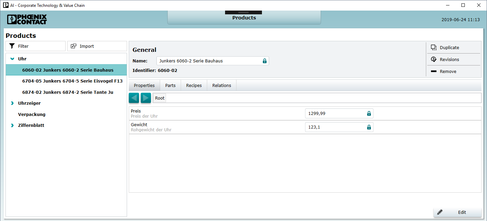
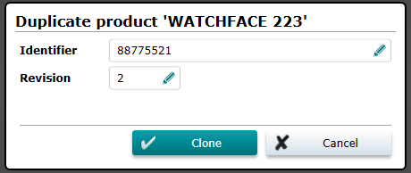
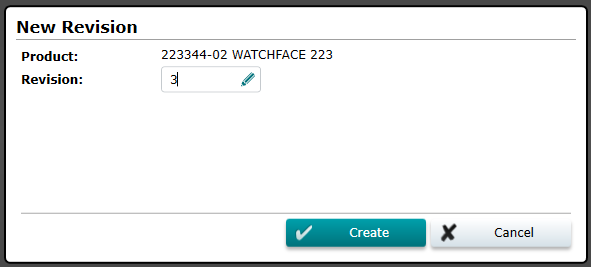
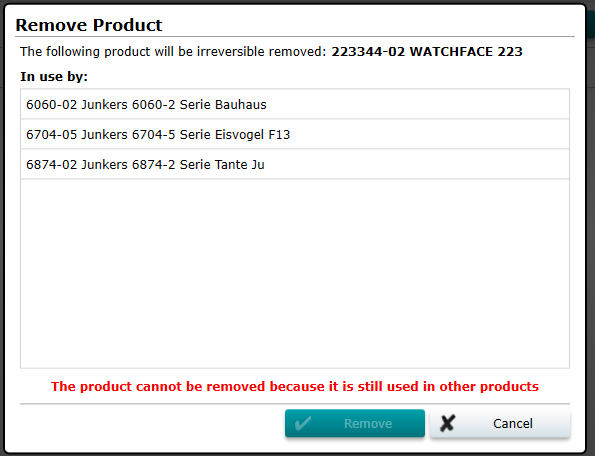
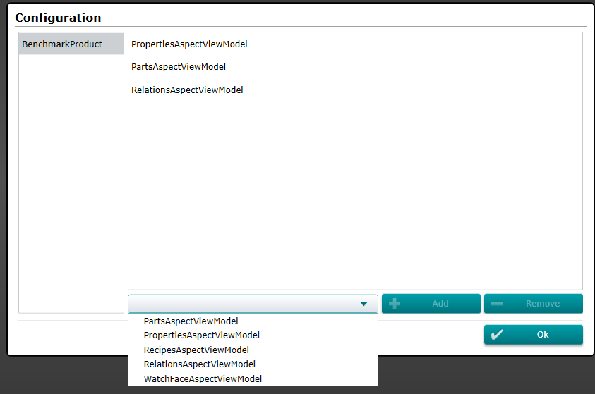
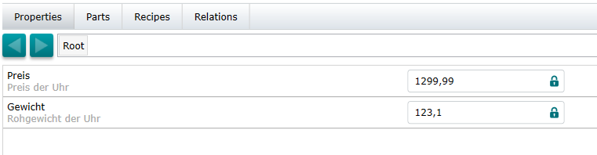
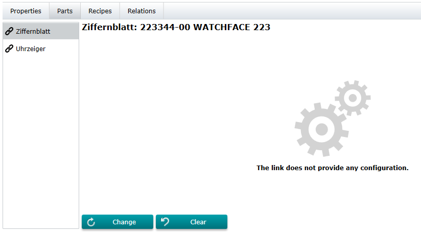
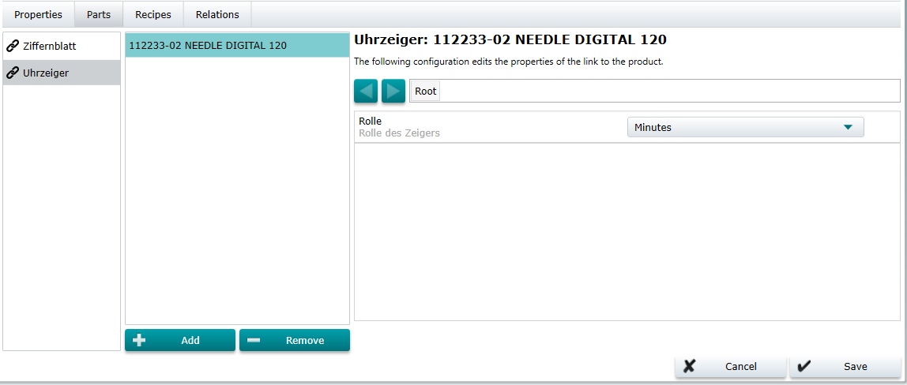
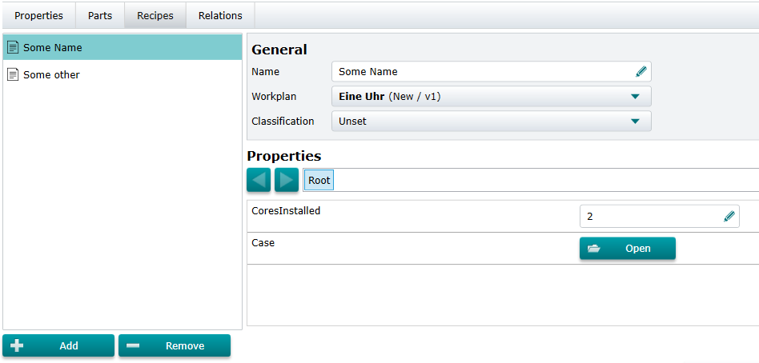

# Product Management

The product management manages all information of a product from the master data over the production until the finished article. In the context of the Control System a product the type or the "catalog" product which a custom can choose for an order. The article is the instance or the physical produced part which gets a customer for his order.

## Overview

The products ui is structured as a master detail navigation. On the left side, the user can see the complete product structure. If the user click on an item, a product type specific [details view](xref:ProductDetails). will be opened. If no type specific details view was found, the default implementation will be used.

The left structure shows the structure of all availabel products. Each product is shown in the last revision by default. The details can be shown after clicking on a product. The details can be changed by using the `Edit Mode`. The edit mode will be activated after a click on the `Edit` button. All properties inside of the detail view are now open for changes. It is possible that more than one user can edit the details of the product in the same time but only the last save will remain.

## Product Details

If the user selects a product the product detail view is opened on the right side. The detail view has variable contents depending on the selected product.

## Edit a Product

By pressing the edit button the application changes to edit mode and the user can change some settings of the selected product. If the user presses `Cancel` all changes are discarded. `Save` saves all changes to the server.

## Duplicate a Product

Products can be duplicated by the user by clicking on `Duplicate`. For duplication a new identifier and revision is necessary. The following dialog will be opened to enter the required information:

## Revisions of a Product

A click on the `Revisions` button will open the following dialog which shows all available revisions of the selected product. The user can select an old revision by selecting the matching revision and press the `Open` button. The selected product revision will be loaded and visible in the details view.

To create a revision to each product, the user clicks on the `Revision` button. After clicking on the `Create` button the following dialog will be opened. There is a suggestion of the next revision number but the user can change it.  A change of the number will lead to a check if the number is already used or not. If the revision number is already used then an error text will be shown. If all data are valid then the `Create` button will be activated and a new revision can be created by pressing `Create`.

## Remove a Product

Skilled workers can also remove products, if they are no longer needed, faulty or were created accidentally. A dialog opens asking the user for confirmation of the action. After a click on the button `Remove product` the server will try to delete the product after ensuring that it is not used as a part in other products. If the product was removed the dialog closes, otherwise it remains open and displays all products that prevent the removal from going through.

## Aspects

The default Product Detail View is divided up into aspects. An aspect represents only a part of a product. 

The aspects for a product type can be configured with the configuration:

### Aspect: Properties

The properties aspect can display the general properties of a product. By default they will be displayed by the generic entry editor.

### Aspect: Parts

More important: The part editor provides features to edit part links to other products and to edit link information. In general it is distinguished between *single parts* and *multiple parts*. Both will get different editor features:

**Single Part Link:**

Single part links must not be set. Therefore a `Clear` button is provided. Another opetion is to change the linked product by `Change`.

**Multiple Part Links:**

Multiple part links can not be replaced, they can be added or removed by `Add` or `Remove`.

### Aspect: Recipes

The `Recipes` aspect provides features to manage recipes of a product. They can be added by `Add` or removed by `Remove`.

