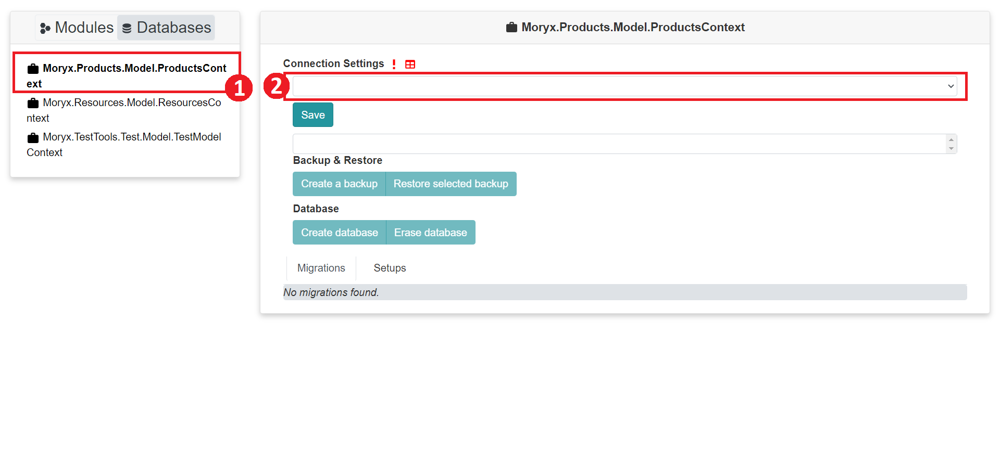
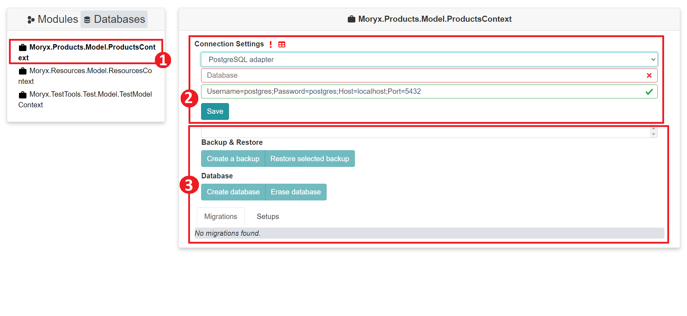
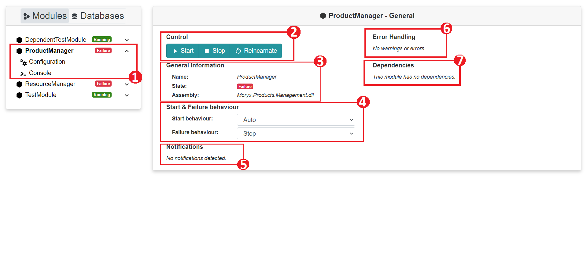
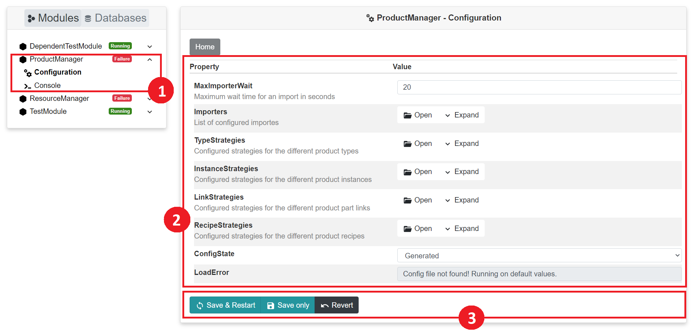

# Maintenance

Everything regarding module and database configurations in Moryx is located in maintenance.

# Databases overview

The page that is displayed by default, when you are in the maintenance, is the **Databases overview** page.
 
 1. Maintenance Navigation menu. 
 2. Database Models/contexts that are available within MORYX.
 3. Information Panel: It contains/displays all the information and details about the selected database model/context in number **2**

 # Database Connection Settings

 For a MORYX module to work, you need to configure a database coresponding to the given module. For instance in the image below the **Moryx.Products.Model.ProductsContext** is related to the **ProductManager**. Therefore setting up the database is a must for the module to work.

 
 1. Selected Database context, in this case **ProductsContext**
 2. Droplist containing all the database provider/adapter that exist in MORYX.

 
 1. By selecting an adapter/provider, in this case **Postgres SQL** we can proceed to fill in the required informations to create and connect to the database.
 2. Buttons to create a backup or restore and existing database. Buttons to create a new database or erase an existing database.

 # Modules

 The **Modules** tab contains everything needed to configure a MORYX module.

  
 1. Modules that are available within MORYX: Each module also displays a status badge representing the state of the corresponding module.
 2. Information Panel: It contains/displays all the information and details about the selected Module in number **1**

 # Module Overview 

  
All modules contain:
 1. **Configuration** and **Console** sub-menu. 
 2. Buttons to Start, stop or reincarnate/restart the module, if needed.
 3. Information regarding the current module.
 4. Behavior configuration for the module.
 5. All the notification (warnings,errors,exceptions etc..) regarding the current module
 6. In case of a warning/error a button that will help to handle it.
 7. All the depedencies of the current module.

 # Module Configuration
The **Configuration** sub-menu shows all existing properties with their values for configuration of the module. With the buttons you can save the changes and restart the module, save the change without restarting the module as well as revert the changes to their previous state.
  