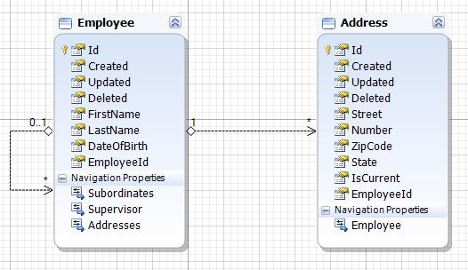

# Model Setups

For our tutorials we will use a rather simple reference model that contains a couple of entities and relations between them. This tutorial does not include model merge of any kind. I assume that if you understood model merge and model setups you will be capable of doing this yourself.

**Our sample model**
As a sample model we will use a small datamodel that could be used to manage a companies staff. It will have employee, address and relation data. Do not use it as a design reference as it is neither optimized nor normalized. It serves the plain purpose of demonstrating how to insert data into the database with a setup. The schematic model is shown below:



## Hard coded setup

As a first example we will start by creating some key employees hard coded. It will create the boss as well as his assistant and an in-turn. To create a model setup create a new class within you model assembly or create new ClassLibrary project with all necessary references. Inherit it from [IModelSetup](xref:Moryx.Model.IModelSetup) and add the [ModelSetupAttribute](xref:Moryx.Model.ModelSetupAttribute).

````cs
[ModelSetup(typeof(EmployeeContext))]
public class HardCodedSetup : IModelSetup
{
    public int SortOrder => 1;
    public string Name => "Sample";
    public string Description => "Sample Description";
    public string SupportedFileRegex => string.Empty;
    [...]
}
````

### Hard coded infrastructure

First we have to take care of the properties required by the Runtime. They are necessary for the framework to find, match and map the setups correctly:

| Property | Description |
|----------|-------------|
| SortOrder | In many cases you will have more than one setup for a model. If any of these setups depend on each other and must be executed in a certain order please assign the sort order accordingly. Otherwise just return 1. |
| Name | Short and hopefully unique name of this setup. |
| Description | Short description to indicate what this setup will do and wich data is created. |
| SupportedFileRegex | The regex for files we can import. Since this setup is hard coded leave it empty. |

### Hard coded entity creation

When the setup gets executed, MORYX will create a `IUnitOfWork` and provides it within the `Execute` method. Here everything can be done for setting up the database:

````cs
public Task Execute(IUnitOfWork openContext, string setupData)
{
}
````

## File based setup

In many cases we have to import from other system through some export formats or we create our own import file standard. In any case we have to read a files content and insert its information into the database. For our example we will use a very simple file format that does not require any complex file parsing. If you have to parse CSV or Excel files, please refer to the CsvHelper or EPPlus documentation.

### File based infrastructure

The infrastructure properties of file based setups are the same except for the `SupportedFileRegex`. Here we must define a naming scheme to map files to this setup. In our example we will use `EmployeeCard_\w+\.txt` to match files like `EmployeeCard_Claudia.txt`.

````cs
public string SupportedFileRegex => @"EmployeeCard_\w+\.txt";
````

### File based entity creation

For our setup we will assume that each line contains one or more properties always in the same format. The following file format should be imported:

````text
Claudia Bach
21.04.1991
Highway to perfection:42
12345 NRW
Kathrin Cole
````

A setup parsing the file and creating the entity might look likes this:

````cs
public async Task Execute(IUnitOfWork uow, string setupData)
{
    var employeeRepo = uow.GetRepository<IEmployeeRepository>();
    var addressRepo = uow.GetRepository<IAddressRepository>();

    var index = 0;
    var lines = File.ReadAllLines(setupData);

    // Line 1: Full name, Line 2: Birthday
    var name = lines[index++].Split(' ');
    var birthDay = DateTime.Parse(lines[index++]);

    // Line 3: Street and number
    var streetAndNumber = lines[index++].Split(':');
    var street = streetAndNumber[0];
    var number = int.Parse(streetAndNumber[1]);

    // Line 4: Zip code and state
    var zipAndState = lines[index++].Split(' ');
    var zip = int.Parse(zipAndState[0]);
    var state = zipAndState[1];

    // Line 5: Optional supervisor
    var supervisor = new[] { string.Empty, string.Empty };
    if (index < lines.Length)
        supervisor = lines[index].Split(' ');

    // Create entity
    var employee = await employeeRepo.CreateAsync(name[0], name[1], birthDay);
    var address = await addressRepo.CreateAsync(street, number, zip, state);
    employee.Addresses.Add(address);
    employee.Supervisor = employeeRepo.GetMatch(supervisor[0], supervisor[1]);

    await uow.SaveChangesAsync();
}
````
