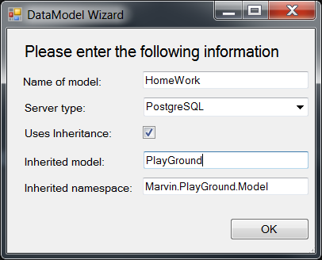
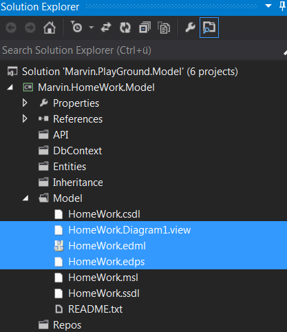

Create and cleanup the new data model
=====================================

At the end of this tutorial we want to customize the data model a little bit. For that create a new data model
based on the PlayGround with the wizard as the images shows.

Do a project cleanup of the new model like the first time. Exclude these files from the project:
